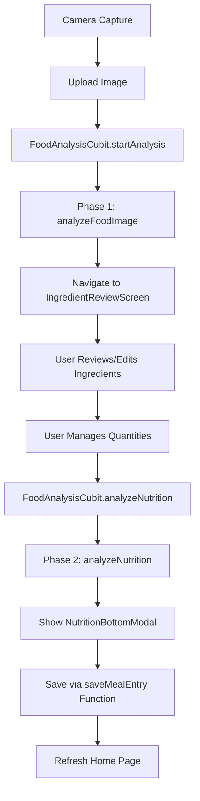
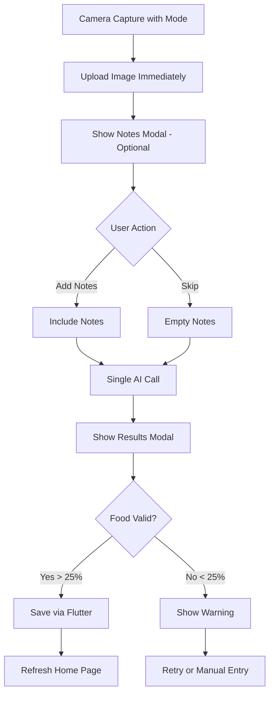

# Flutter - AI Calories Analysis Flow Modification

## 📊 Current Flow vs New Flow Comparison

### **BEFORE: Complex Two-Phase Flow with Ingredient Management**



**User Steps:** 7-8 interactions  
**Screens:** 3 (Camera → Ingredient Review → Nutrition Modal)  
**State Management:** Complex (ingredients, quantities, serving amounts)  
**Time to Result:** 15-25 seconds + review time  

### **AFTER: Streamlined Single-Phase Flow**



**User Steps:** 2-3 interactions  
**Screens:** 2 (Camera → Results Modal)  
**State Management:** Minimal (image, notes, result)  
**Time to Result:** 8-12 seconds  

---

## 🚀 Step-by-Step Implementation Guide

### **Phase 1: Update Domain Layer**

#### Step 1.1: Create New Unified Result Entity
```bash
# Create new entity file
touch lib/feature/ai/domain/entities/unified_analysis_result.dart
```

```dart
// lib/feature/ai/domain/entities/unified_analysis_result.dart
import 'package:freezed_annotation/freezed_annotation.dart';
import '../../../../core/domain/entities/nutrition_data.dart';

part 'unified_analysis_result.freezed.dart';
part 'unified_analysis_result.g.dart';

@freezed
class UnifiedAnalysisResult with _$UnifiedAnalysisResult {
  const factory UnifiedAnalysisResult({
    required bool success,
    required String sessionId,
    required String mode, // 'meal' or 'label'
    
    // Core data
    required String mealName,
    required NutritionData nutrition,
    
    // Confidence metrics
    required double confidence,
    required FoodValidity foodValidity,
    
    // Supporting data
    @Default([]) List<SimpleIngredient> ingredients,
    String? servingSize,
    @Default(1.0) double servingsAnalyzed,
    
    // Metadata
    required int processingTime,
    required String model,
    required String language,
    required String unitSystem,
    String? userNotes,
    
    // Warnings
    @Default([]) List<String> warnings,
    @Default([]) List<String> suggestions,
  }) = _UnifiedAnalysisResult;

  const UnifiedAnalysisResult._();

  factory UnifiedAnalysisResult.fromJson(Map<String, dynamic> json) =>
      _$UnifiedAnalysisResultFromJson(json);
      
  // Helper getters
  bool get isValidFood => foodValidity.score > 0.25;
  bool get hasHighConfidence => confidence > 0.7;
  bool get needsWarning => foodValidity.score < 0.25;
}

@freezed
class FoodValidity with _$FoodValidity {
  const factory FoodValidity({
    required double score, // 0.0 to 1.0
    required bool isFood,
    String? warningMessage,
    required String category, // meal, packaged_food, beverage, non_food, unclear
  }) = _FoodValidity;

  factory FoodValidity.fromJson(Map<String, dynamic> json) =>
      _$FoodValidityFromJson(json);
}

@freezed
class SimpleIngredient with _$SimpleIngredient {
  const factory SimpleIngredient({
    required String name,
    required double quantity,
    required String unit,
    required double calories,
  }) = _SimpleIngredient;

  factory SimpleIngredient.fromJson(Map<String, dynamic> json) =>
      _$SimpleIngredientFromJson(json);
}
```

#### Step 1.2: Update Repository Interface
```dart
// lib/feature/ai/domain/repositories/ai_repository.dart
import '../entities/unified_analysis_result.dart';

abstract class AIRepository {
  /// Upload image to Firebase Storage
  Future<String> uploadFoodImage(String localImagePath);
  
  /// Analyze meal image with optional notes
  Future<UnifiedAnalysisResult> analyzeMealImage({
    required String storagePath,
    String? notes,
    required String language,
    required String unitSystem,
  });
  
  /// Analyze nutrition label with optional notes
  Future<UnifiedAnalysisResult> analyzeLabelImage({
    required String storagePath,
    String? notes,
    required String language,
    required String unitSystem,
  });
  
  // Remove old methods:
  // - analyzeFoodImage()
  // - analyzeNutrition()
  // - saveMealEntry()
}
```

---

### **Phase 2: Update Data Layer**

#### Step 2.1: Implement New Repository Methods
```dart
// lib/feature/ai/data/repositories/ai_repository_impl.dart
import 'package:injecteo/injecteo.dart';
import 'package:cloud_functions/cloud_functions.dart';
import 'package:firebase_storage/firebase_storage.dart';
import 'dart:io';
import 'dart:developer';
import '../../domain/repositories/ai_repository.dart';
import '../../domain/entities/unified_analysis_result.dart';
import '../../domain/entities/ai_error.dart';
import '../../../../core/services/firebase_service.dart';

@LazySingleton(as: AIRepository)
class AIRepositoryImpl implements AIRepository {
  final FirebaseService _firebaseService;
  late final FirebaseFunctions _functions;
  late final FirebaseStorage _storage;

  AIRepositoryImpl(this._firebaseService) {
    _functions = FirebaseFunctions.instanceFor(
      app: _firebaseService.auth.app,
      region: 'europe-west1',
    );
    _storage = FirebaseStorage.instanceFor(app: _firebaseService.auth.app);
  }

  @override
  Future<String> uploadFoodImage(String localImagePath) async {
    try {
      final userId = _firebaseService.currentUserId;
      if (userId == null) {
        throw AIError.authenticationError();
      }

      final file = File(localImagePath);
      final fileName = 
          'food_analysis/$userId/${DateTime.now().millisecondsSinceEpoch}.jpg';

      final ref = _storage.ref().child(fileName);
      
      // Upload with metadata
      final metadata = SettableMetadata(
        contentType: 'image/jpeg',
        customMetadata: {
          'userId': userId,
          'timestamp': DateTime.now().toIso8601String(),
        },
      );
      
      final uploadTask = ref.putFile(file, metadata);
      
      // Monitor upload progress (optional)
      uploadTask.snapshotEvents.listen((TaskSnapshot snapshot) {
        final progress = snapshot.bytesTransferred / snapshot.totalBytes;
        log('Upload progress: ${(progress * 100).toStringAsFixed(0)}%');
      });

      await uploadTask;
      return fileName; // Return storage path
    } on FirebaseException catch (e) {
      if (e.code == 'unauthorized') {
        throw AIError.authenticationError();
      } else if (e.code == 'storage/quota-exceeded') {
        throw AIError.quotaExceeded();
      }
      throw AIError.imageUploadError(details: e.message);
    } catch (e) {
      throw AIError.imageUploadError(details: e.toString());
    }
  }

  @override
  Future<UnifiedAnalysisResult> analyzeMealImage({
    required String storagePath,
    String? notes,
    required String language,
    required String unitSystem,
  }) async {
    try {
      final userId = _firebaseService.currentUserId;
      if (userId == null) {
        throw AIError.authenticationError();
      }

      log('[AI] Starting meal analysis for path: $storagePath');
      log('[AI] Notes: ${notes ?? "No notes provided"}');
      
      final callable = _functions.httpsCallable(
        'analyzeMealImageFunction',
        options: HttpsCallableOptions(
          timeout: const Duration(seconds: 120),
        ),
      );

      final result = await callable.call({
        'storagePath': storagePath,
        'language': language,
        'unitSystem': unitSystem,
        'notes': notes ?? '',
      });

      log('[AI] Response received: ${result.data}');
      
      final analysisResult = UnifiedAnalysisResult.fromJson(
        result.data as Map<String, dynamic>
      );
      
      // Check food validity
      if (analysisResult.needsWarning) {
        log('[AI] Warning: Low food validity score: ${analysisResult.foodValidity.score}');
      }
      
      return analysisResult;
      
    } on FirebaseFunctionsException catch (e) {
      log('[AI] Firebase Function error: ${e.code} - ${e.message}');
      _handleFunctionError(e);
      rethrow;
    } catch (e) {
      log('[AI] Unexpected error: $e');
      throw AIError.analysisError(details: e.toString());
    }
  }

  @override
  Future<UnifiedAnalysisResult> analyzeLabelImage({
    required String storagePath,
    String? notes,
    required String language,
    required String unitSystem,
  }) async {
    try {
      final userId = _firebaseService.currentUserId;
      if (userId == null) {
        throw AIError.authenticationError();
      }

      log('[AI] Starting label analysis for path: $storagePath');
      
      final callable = _functions.httpsCallable(
        'analyzeLabelImageFunction',
        options: HttpsCallableOptions(
          timeout: const Duration(seconds: 120),
        ),
      );

      final result = await callable.call({
        'storagePath': storagePath,
        'language': language,
        'unitSystem': unitSystem,
        'notes': notes ?? '',
      });

      log('[AI] Label analysis response received');
      
      return UnifiedAnalysisResult.fromJson(
        result.data as Map<String, dynamic>
      );
      
    } on FirebaseFunctionsException catch (e) {
      _handleFunctionError(e);
      rethrow;
    } catch (e) {
      throw AIError.analysisError(details: e.toString());
    }
  }
  
  void _handleFunctionError(FirebaseFunctionsException e) {
    switch (e.code) {
      case 'unauthenticated':
        throw AIError.authenticationError();
      case 'resource-exhausted':
        throw AIError.quotaExceeded();
      case 'invalid-argument':
        throw AIError.validationError(e.message ?? 'Invalid input');
      case 'deadline-exceeded':
        throw AIError.analysisError(details: 'Analysis timeout');
      default:
        throw AIError.analysisError(details: e.message);
    }
  }
}
```

---

### **Phase 3: Simplify State Management**

#### Step 3.1: Update FoodAnalysisState
```dart
// lib/feature/ai/presentation/cubit/food_analysis_state.dart
import 'package:freezed_annotation/freezed_annotation.dart';
import '../../domain/entities/unified_analysis_result.dart';
import '../../domain/entities/ai_error.dart';

part 'food_analysis_state.freezed.dart';

enum FoodAnalysisPhase {
  idle,
  uploadingImage,
  analyzing,    // Single analysis phase
  completed,
  failed,
}

@freezed
class FoodAnalysisState with _$FoodAnalysisState {
  const factory FoodAnalysisState({
    // Flow state
    @Default(FoodAnalysisPhase.idle) FoodAnalysisPhase currentPhase,
    @Default(false) bool isProcessing,
    
    // Analysis mode
    String? analysisMode, // 'meal' or 'label'
    
    // Image data
    String? localImagePath,
    String? storagePath,
    
    // User input
    String? userNotes,
    
    // Results
    UnifiedAnalysisResult? result,
    
    // User preferences
    @Default('English') String language,
    @Default('metric') String unitSystem,
    
    // Error handling
    String? errorMessage,
    AIError? currentError,
    @Default(0) int retryCount,
    
    // UI flags
    @Default(false) bool shouldShowRateUs,
    @Default(false) bool showFoodWarning,
  }) = _FoodAnalysisState;

  const FoodAnalysisState._();

  // Simplified computed properties
  bool get hasError => errorMessage != null;
  bool get hasResult => result != null;
  bool get canSave => result != null && result!.isValidFood;
  bool get needsFoodWarning => result != null && result!.needsWarning;
  
  double get progress {
    switch (currentPhase) {
      case FoodAnalysisPhase.idle:
        return 0.0;
      case FoodAnalysisPhase.uploadingImage:
        return 0.3;
      case FoodAnalysisPhase.analyzing:
        return 0.6;
      case FoodAnalysisPhase.completed:
        return 1.0;
      case FoodAnalysisPhase.failed:
        return 0.0;
    }
  }
  
  String get phaseDescription {
    switch (currentPhase) {
      case FoodAnalysisPhase.idle:
        return 'Ready to analyze';
      case FoodAnalysisPhase.uploadingImage:
        return 'Uploading image...';
      case FoodAnalysisPhase.analyzing:
        return analysisMode == 'label' 
          ? 'Reading nutrition label...' 
          : 'Analyzing your meal...';
      case FoodAnalysisPhase.completed:
        return 'Analysis complete';
      case FoodAnalysisPhase.failed:
        return 'Analysis failed';
    }
  }
}
```

#### Step 3.2: Simplify FoodAnalysisCubit
```dart
// lib/feature/ai/presentation/cubit/food_analysis_cubit.dart
import 'package:flutter_bloc/flutter_bloc.dart';
import 'package:injecteo/injecteo.dart';
import 'dart:developer';
import 'food_analysis_state.dart';
import '../../domain/repositories/ai_repository.dart';
import '../../domain/entities/unified_analysis_result.dart';
import '../../domain/entities/ai_error.dart';
import '../../../../core/services/firebase_service.dart';
import '../../../purchase/domain/repository/purchase_repository.dart';

@inject
class FoodAnalysisCubit extends Cubit<FoodAnalysisState> {
  final AIRepository _aiRepository;
  final FirebaseService _firebaseService;
  final PurchaseRepository _purchaseRepository;

  FoodAnalysisCubit(
    this._aiRepository,
    this._firebaseService,
    this._purchaseRepository,
  ) : super(const FoodAnalysisState());

  /// Single unified analysis method
  Future<void> analyzeFoodImage({
    required String imagePath,
    required String mode, // 'meal' or 'label'
    String? notes,
    String? language,
    String? unitSystem,
  }) async {
    try {
      log('[Cubit] Starting $mode analysis');
      
      // Check premium status
      final canAnalyze = await _canUseAIAnalysis();
      if (!canAnalyze) {
        emit(state.copyWith(
          errorMessage: 'Premium subscription required',
          currentError: AIError.quotaExceeded(),
        ));
        return;
      }

      // Start upload
      emit(state.copyWith(
        currentPhase: FoodAnalysisPhase.uploadingImage,
        isProcessing: true,
        localImagePath: imagePath,
        analysisMode: mode,
        userNotes: notes,
        language: language ?? 'English',
        unitSystem: unitSystem ?? 'metric',
        errorMessage: null,
        retryCount: 0,
      ));

      // Upload image
      final storagePath = await _aiRepository.uploadFoodImage(imagePath);
      log('[Cubit] Image uploaded: $storagePath');

      // Update state to analyzing
      emit(state.copyWith(
        storagePath: storagePath,
        currentPhase: FoodAnalysisPhase.analyzing,
      ));

      // Call appropriate analysis function
      final UnifiedAnalysisResult result;
      if (mode == 'label') {
        result = await _aiRepository.analyzeLabelImage(
          storagePath: storagePath,
          notes: notes,
          language: state.language,
          unitSystem: state.unitSystem,
        );
      } else {
        result = await _aiRepository.analyzeMealImage(
          storagePath: storagePath,
          notes: notes,
          language: state.language,
          unitSystem: state.unitSystem,
        );
      }

      log('[Cubit] Analysis complete. Calories: ${result.nutrition.calories}');
      
      // Check if we need to show food warning
      final showWarning = result.needsWarning;
      
      // Emit success state
      emit(state.copyWith(
        currentPhase: FoodAnalysisPhase.completed,
        isProcessing: false,
        result: result,
        showFoodWarning: showWarning,
      ));

      // Record usage for monetization
      await _recordAnalysisUsage();
      
      // Check for rate prompt
      await _checkRateUsPrompt();
      
    } catch (e) {
      log('[Cubit] Analysis error: $e');
      final aiError = e is AIError 
        ? e 
        : AIError.analysisError(details: e.toString());
        
      emit(state.copyWith(
        currentPhase: FoodAnalysisPhase.failed,
        isProcessing: false,
        errorMessage: aiError.userMessage,
        currentError: aiError,
        retryCount: state.retryCount + 1,
      ));
    }
  }

  /// Update user notes
  void updateNotes(String notes) {
    emit(state.copyWith(userNotes: notes));
  }

  /// Retry failed analysis
  Future<void> retry() async {
    if (state.localImagePath != null && state.analysisMode != null) {
      await analyzeFoodImage(
        imagePath: state.localImagePath!,
        mode: state.analysisMode!,
        notes: state.userNotes,
        language: state.language,
        unitSystem: state.unitSystem,
      );
    }
  }

  /// Reset analysis state
  void reset() {
    emit(const FoodAnalysisState());
  }

  /// Clear error
  void clearError() {
    emit(state.copyWith(
      errorMessage: null,
      currentError: null,
      showFoodWarning: false,
    ));
  }

  /// Clear rate prompt
  void clearRateUsPrompt() {
    emit(state.copyWith(shouldShowRateUs: false));
  }

  // Private helper methods
  Future<bool> _canUseAIAnalysis() async {
    try {
      return await _purchaseRepository.canUseAIAnalysis();
    } catch (e) {
      return true; // Allow on error
    }
  }

  Future<void> _recordAnalysisUsage() async {
    try {
      await _purchaseRepository.recordAIAnalysisUsed();
    } catch (e) {
      log('Failed to record usage: $e');
    }
  }

  Future<void> _checkRateUsPrompt() async {
    try {
      final shouldShow = await _purchaseRepository.shouldShowRateUsPrompt();
      if (shouldShow) {
        emit(state.copyWith(shouldShowRateUs: true));
        await _purchaseRepository.recordRateUsPromptShown();
      }
    } catch (e) {
      log('Rate prompt check failed: $e');
    }
  }
}
```

---

### **Phase 4: Create New UI Components**

#### Step 4.1: Create AI Notes Modal
```dart
// lib/feature/ai/presentation/widgets/ai_notes_modal.dart
import 'package:flutter/material.dart';
import 'package:flutter_hooks/flutter_hooks.dart';
import 'dart:io';
import '../../../../core/theme/app_colors.dart';
import '../../../../core/widgets/kalee_text_field.dart';

class AINotesModal extends HookWidget {
  final String imagePath;
  final String mode; // 'meal' or 'label'
  final Function(String? notes) onAnalyze;
  final VoidCallback onCancel;

  const AINotesModal({
    super.key,
    required this.imagePath,
    required this.mode,
    required this.onAnalyze,
    required this.onCancel,
  });

  @override
  Widget build(BuildContext context) {
    final notesController = useTextEditingController();
    final isAnalyzing = useState(false);
    final characterCount = useState(0);

    // Update character count
    useEffect(() {
      void updateCount() {
        characterCount.value = notesController.text.length;
      }
      notesController.addListener(updateCount);
      return () => notesController.removeListener(updateCount);
    }, [notesController]);

    return Container(
      height: MediaQuery.of(context).size.height * 0.75,
      decoration: const BoxDecoration(
        color: Colors.white,
        borderRadius: BorderRadius.vertical(top: Radius.circular(20)),
      ),
      child: Column(
        children: [
          // Handle bar
          Container(
            width: 40,
            height: 4,
            margin: const EdgeInsets.only(top: 12),
            decoration: BoxDecoration(
              color: Colors.grey[300],
              borderRadius: BorderRadius.circular(2),
            ),
          ),

          // Image preview
          Container(
            height: 200,
            margin: const EdgeInsets.all(16),
            decoration: BoxDecoration(
              borderRadius: BorderRadius.circular(12),
              image: DecorationImage(
                image: FileImage(File(imagePath)),
                fit: BoxFit.cover,
              ),
            ),
            child: Stack(
              children: [
                // Gradient overlay
                Container(
                  decoration: BoxDecoration(
                    borderRadius: BorderRadius.circular(12),
                    gradient: LinearGradient(
                      begin: Alignment.topCenter,
                      end: Alignment.bottomCenter,
                      colors: [
                        Colors.transparent,
                        Colors.black.withOpacity(0.3),
                      ],
                    ),
                  ),
                ),
                // Mode indicator
                Positioned(
                  bottom: 8,
                  left: 8,
                  child: Container(
                    padding: const EdgeInsets.symmetric(
                      horizontal: 12,
                      vertical: 4,
                    ),
                    decoration: BoxDecoration(
                      color: mode == 'meal' 
                        ? AppColors.primary 
                        : AppColors.secondary,
                      borderRadius: BorderRadius.circular(12),
                    ),
                    child: Text(
                      mode == 'meal' ? '🍽️ Meal' : '🏷️ Label',
                      style: const TextStyle(
                        color: Colors.white,
                        fontSize: 12,
                        fontWeight: FontWeight.bold,
                      ),
                    ),
                  ),
                ),
              ],
            ),
          ),

          // Content
          Expanded(
            child: Padding(
              padding: const EdgeInsets.all(16),
              child: Column(
                crossAxisAlignment: CrossAxisAlignment.start,
                children: [
                  // Title
                  Text(
                    'Add Notes (Optional)',
                    style: Theme.of(context).textTheme.titleLarge?.copyWith(
                      fontWeight: FontWeight.bold,
                    ),
                  ),
                  const SizedBox(height: 8),
                  
                  // Helper text
                  Text(
                    mode == 'meal'
                      ? 'Help us identify your meal accurately - add details not visible in the image'
                      : 'Specify serving size or portion if different from package',
                    style: TextStyle(
                      color: Colors.grey[600],
                      fontSize: 14,
                    ),
                  ),
                  const SizedBox(height: 16),

                  // Notes input
                  KaleeTextField(
                    controller: notesController,
                    hintText: mode == 'meal'
                      ? 'e.g., "200g white rice", "Cooked with olive oil", "McDonald\'s Big Mac"'
                      : 'e.g., "Half package", "2 servings", "With 200ml milk"',
                    maxLines: 3,
                    maxLength: 200,
                  ),

                  // Character count
                  Align(
                    alignment: Alignment.centerRight,
                    child: Text(
                      '${characterCount.value}/200',
                      style: TextStyle(
                        color: characterCount.value > 180 
                          ? Colors.orange 
                          : Colors.grey[500],
                        fontSize: 12,
                      ),
                    ),
                  ),
                  const SizedBox(height: 16),

                  // Examples
                  Text(
                    'Examples:',
                    style: TextStyle(
                      color: Colors.grey[700],
                      fontSize: 12,
                      fontWeight: FontWeight.bold,
                    ),
                  ),
                  const SizedBox(height: 4),
                  ...(_getExamples(mode).map((example) => Padding(
                    padding: const EdgeInsets.only(left: 8, top: 2),
                    child: Row(
                      children: [
                        Icon(
                          Icons.circle,
                          size: 4,
                          color: Colors.grey[400],
                        ),
                        const SizedBox(width: 8),
                        Expanded(
                          child: Text(
                            example,
                            style: TextStyle(
                              color: Colors.grey[600],
                              fontSize: 12,
                            ),
                          ),
                        ),
                      ],
                    ),
                  ))),
                ],
              ),
            ),
          ),

          // Action buttons
          Container(
            padding: const EdgeInsets.all(16),
            decoration: BoxDecoration(
              color: Colors.grey[50],
              border: Border(
                top: BorderSide(
                  color: Colors.grey[300]!,
                  width: 1,
                ),
              ),
            ),
            child: Row(
              children: [
                // Skip button
                Expanded(
                  child: OutlinedButton(
                    onPressed: isAnalyzing.value ? null : onCancel,
                    style: OutlinedButton.styleFrom(
                      padding: const EdgeInsets.symmetric(vertical: 16),
                    ),
                    child: const Text('Cancel'),
                  ),
                ),
                const SizedBox(width: 16),
                
                // Analyze button
                Expanded(
                  flex: 2,
                  child: ElevatedButton(
                    onPressed: isAnalyzing.value 
                      ? null 
                      : () {
                          isAnalyzing.value = true;
                          final notes = notesController.text.isEmpty 
                            ? null 
                            : notesController.text;
                          onAnalyze(notes);
                        },
                    style: ElevatedButton.styleFrom(
                      backgroundColor: AppColors.primary,
                      foregroundColor: Colors.white,
                      padding: const EdgeInsets.symmetric(vertical: 16),
                    ),
                    child: isAnalyzing.value
                      ? const SizedBox(
                          height: 20,
                          width: 20,
                          child: CircularProgressIndicator(
                            strokeWidth: 2,
                            color: Colors.white,
                          ),
                        )
                      : const Text(
                          'Analyze',
                          style: TextStyle(
                            fontWeight: FontWeight.bold,
                            fontSize: 16,
                          ),
                        ),
                  ),
                ),
              ],
            ),
          ),
        ],
      ),
    );
  }

  List<String> _getExamples(String mode) {
    if (mode == 'meal') {
      return [
        'Portion size (e.g., "Large portion", "Kids meal")',
        'Cooking method (e.g., "Deep fried", "Grilled")',
        'Hidden ingredients (e.g., "Extra cheese", "No sauce")',
        'Restaurant/brand (e.g., "Starbucks", "Homemade")',
      ];
    } else {
      return [
        'Actual portion (e.g., "Half bag", "2 cookies")',
        'Preparation (e.g., "With milk", "Dry")',
        'Serving adjustments (e.g., "Double serving")',
      ];
    }
  }
}
```

#### Step 4.2: Create AI Results Modal
```dart
// lib/feature/ai/presentation/widgets/ai_results_modal.dart
import 'package:flutter/material.dart';
import 'package:flutter_hooks/flutter_hooks.dart';
import 'package:hooked_bloc/hooked_bloc.dart';
import '../../../../core/theme/app_colors.dart';
import '../../domain/entities/unified_analysis_result.dart';
import '../../../home/presentation/cubit/home_page_cubit.dart';

class AIResultsModal extends HookWidget {
  final UnifiedAnalysisResult result;
  final String? imagePath;
  final VoidCallback onDiscard;

  const AIResultsModal({
    super.key,
    required this.result,
    this.imagePath,
    required this.onDiscard,
  });

  @override
  Widget build(BuildContext context) {
    final homePageCubit = useBloc<HomePageCubit>();
    final isSaving = useState(false);

    // Show warning if food validity is low
    useEffect(() {
      if (result.needsWarning) {
        Future.delayed(const Duration(milliseconds: 500), () {
          _showFoodWarningDialog(context);
        });
      }
      return null;
    }, []);

    return Container(
      constraints: BoxConstraints(
        maxHeight: MediaQuery.of(context).size.height * 0.85,
      ),
      decoration: const BoxDecoration(
        color: Colors.white,
        borderRadius: BorderRadius.vertical(top: Radius.circular(20)),
      ),
      child: Column(
        mainAxisSize: MainAxisSize.min,
        children: [
          // Handle bar
          Container(
            width: 40,
            height: 4,
            margin: const EdgeInsets.only(top: 12, bottom: 16),
            decoration: BoxDecoration(
              color: Colors.grey[300],
              borderRadius: BorderRadius.circular(2),
            ),
          ),

          // Header
          Padding(
            padding: const EdgeInsets.symmetric(horizontal: 20),
            child: Row(
              children: [
                Expanded(
                  child: Column(
                    crossAxisAlignment: CrossAxisAlignment.start,
                    children: [
                      Text(
                        result.mealName,
                        style: Theme.of(context).textTheme.headlineSmall?.copyWith(
                          fontWeight: FontWeight.bold,
                        ),
                      ),
                      const SizedBox(height: 4),
                      Row(
                        children: [
                          Icon(
                            result.mode == 'meal' 
                              ? Icons.restaurant 
                              : Icons.label,
                            size: 16,
                            color: Colors.grey[600],
                          ),
                          const SizedBox(width: 4),
                          Text(
                            result.mode == 'meal' ? 'Meal Analysis' : 'Label Scan',
                            style: TextStyle(
                              color: Colors.grey[600],
                              fontSize: 14,
                            ),
                          ),
                        ],
                      ),
                    ],
                  ),
                ),
                IconButton(
                  onPressed: onDiscard,
                  icon: const Icon(Icons.close),
                ),
              ],
            ),
          ),

          const SizedBox(height: 20),

          // Main content
          Expanded(
            child: SingleChildScrollView(
              padding: const EdgeInsets.symmetric(horizontal: 20),
              child: Column(
                children: [
                  // Calories card
                  _buildCaloriesCard(context),
                  const SizedBox(height: 16),
                  
                  // Macros card
                  _buildMacrosCard(context),
                  const SizedBox(height: 16),
                  
                  // Confidence indicator
                  _buildConfidenceCard(context),
                  
                  if (result.ingredients.isNotEmpty) ...[
                    const SizedBox(height: 16),
                    _buildIngredientsCard(context),
                  ],
                  
                  const SizedBox(height: 20),
                ],
              ),
            ),
          ),

          // Action buttons
          Container(
            padding: const EdgeInsets.all(16),
            decoration: BoxDecoration(
              color: Colors.grey[50],
              border: Border(
                top: BorderSide(color: Colors.grey[300]!),
              ),
            ),
            child: Row(
              children: [
                Expanded(
                  child: OutlinedButton(
                    onPressed: isSaving.value ? null : onDiscard,
                    style: OutlinedButton.styleFrom(
                      padding: const EdgeInsets.symmetric(vertical: 14),
                    ),
                    child: const Text('Discard'),
                  ),
                ),
                const SizedBox(width: 16),
                Expanded(
                  flex: 2,
                  child: ElevatedButton.icon(
                    onPressed: isSaving.value || !result.isValidFood
                      ? null
                      : () => _saveMeal(context, homePageCubit, isSaving),
                    icon: isSaving.value
                      ? const SizedBox(
                          width: 16,
                          height: 16,
                          child: CircularProgressIndicator(
                            strokeWidth: 2,
                            color: Colors.white,
                          ),
                        )
                      : const Icon(Icons.save),
                    label: Text(isSaving.value ? 'Saving...' : 'Save Meal'),
                    style: ElevatedButton.styleFrom(
                      backgroundColor: AppColors.primary,
                      foregroundColor: Colors.white,
                      padding: const EdgeInsets.symmetric(vertical: 14),
                    ),
                  ),
                ),
              ],
            ),
          ),
        ],
      ),
    );
  }

  Widget _buildCaloriesCard(BuildContext context) {
    return Card(
      elevation: 4,
      child: Padding(
        padding: const EdgeInsets.all(20),
        child: Column(
          children: [
            Text(
              '${result.nutrition.calories.round()}',
              style: TextStyle(
                fontSize: 56,
                fontWeight: FontWeight.bold,
                color: AppColors.primary,
              ),
            ),
            Text(
              'calories',
              style: TextStyle(
                fontSize: 18,
                color: Colors.grey[600],
              ),
            ),
            if (result.servingSize != null) ...[
              const SizedBox(height: 8),
              Text(
                'Serving: ${result.servingSize}',
                style: TextStyle(
                  fontSize: 14,
                  color: Colors.grey[500],
                ),
              ),
            ],
          ],
        ),
      ),
    );
  }

  Widget _buildMacrosCard(BuildContext context) {
    final nutrition = result.nutrition;
    return Card(
      child: Padding(
        padding: const EdgeInsets.all(16),
        child: Column(
          crossAxisAlignment: CrossAxisAlignment.start,
          children: [
            Text(
              'Macronutrients',
              style: Theme.of(context).textTheme.titleMedium?.copyWith(
                fontWeight: FontWeight.bold,
              ),
            ),
            const SizedBox(height: 12),
            _buildMacroRow('Protein', nutrition.protein, 'g', AppColors.proteinRed),
            const SizedBox(height: 8),
            _buildMacroRow('Carbs', nutrition.carbs, 'g', AppColors.carbsBlue),
            const SizedBox(height: 8),
            _buildMacroRow('Fat', nutrition.fat, 'g', AppColors.fatGreen),
          ],
        ),
      ),
    );
  }

  Widget _buildMacroRow(String name, double value, String unit, Color color) {
    return Row(
      children: [
        Container(
          width: 12,
          height: 12,
          decoration: BoxDecoration(
            color: color,
            shape: BoxShape.circle,
          ),
        ),
        const SizedBox(width: 12),
        Expanded(
          child: Text(
            name,
            style: const TextStyle(fontSize: 16),
          ),
        ),
        Text(
          '${value.toStringAsFixed(1)} $unit',
          style: const TextStyle(
            fontSize: 16,
            fontWeight: FontWeight.bold,
          ),
        ),
      ],
    );
  }

  Widget _buildConfidenceCard(BuildContext context) {
    final confidence = result.confidence;
    final foodValidity = result.foodValidity.score;
    
    return Card(
      child: Padding(
        padding: const EdgeInsets.all(16),
        child: Column(
          crossAxisAlignment: CrossAxisAlignment.start,
          children: [
            Row(
              children: [
                Icon(
                  Icons.psychology,
                  size: 20,
                  color: _getConfidenceColor(confidence),
                ),
                const SizedBox(width: 8),
                Text(
                  'AI Confidence',
                  style: Theme.of(context).textTheme.titleSmall,
                ),
              ],
            ),
            const SizedBox(height: 8),
            
            // Overall confidence
            Row(
              children: [
                Expanded(
                  child: LinearProgressIndicator(
                    value: confidence,
                    backgroundColor: Colors.grey[300],
                    valueColor: AlwaysStoppedAnimation(
                      _getConfidenceColor(confidence),
                    ),
                  ),
                ),
                const SizedBox(width: 12),
                Text(
                  '${(confidence * 100).round()}%',
                  style: TextStyle(
                    fontWeight: FontWeight.bold,
                    color: _getConfidenceColor(confidence),
                  ),
                ),
              ],
            ),
            
            // Food validity (if concerning)
            if (foodValidity < 0.75) ...[
              const SizedBox(height: 12),
              Container(
                padding: const EdgeInsets.all(8),
                decoration: BoxDecoration(
                  color: foodValidity < 0.25 
                    ? Colors.red[50] 
                    : Colors.orange[50],
                  borderRadius: BorderRadius.circular(8),
                  border: Border.all(
                    color: foodValidity < 0.25 
                      ? Colors.red[200]! 
                      : Colors.orange[200]!,
                  ),
                ),
                child: Row(
                  children: [
                    Icon(
                      Icons.warning,
                      size: 16,
                      color: foodValidity < 0.25 
                        ? Colors.red[700] 
                        : Colors.orange[700],
                    ),
                    const SizedBox(width: 8),
                    Expanded(
                      child: Text(
                        result.foodValidity.warningMessage ?? 
                        'Low confidence this is food',
                        style: TextStyle(
                          fontSize: 12,
                          color: foodValidity < 0.25 
                            ? Colors.red[700] 
                            : Colors.orange[700],
                        ),
                      ),
                    ),
                  ],
                ),
              ),
            ],
          ],
        ),
      ),
    );
  }

  Widget _buildIngredientsCard(BuildContext context) {
    return Card(
      child: Padding(
        padding: const EdgeInsets.all(16),
        child: Column(
          crossAxisAlignment: CrossAxisAlignment.start,
          children: [
            Text(
              'Detected Ingredients',
              style: Theme.of(context).textTheme.titleSmall?.copyWith(
                fontWeight: FontWeight.bold,
              ),
            ),
            const SizedBox(height: 12),
            ...result.ingredients.map((ing) => Padding(
              padding: const EdgeInsets.symmetric(vertical: 2),
              child: Row(
                children: [
                  Container(
                    width: 6,
                    height: 6,
                    decoration: BoxDecoration(
                      color: AppColors.primary,
                      shape: BoxShape.circle,
                    ),
                  ),
                  const SizedBox(width: 8),
                  Expanded(
                    child: Text(
                      ing.name,
                      style: const TextStyle(fontSize: 14),
                    ),
                  ),
                  Text(
                    '${ing.quantity.round()}${ing.unit}',
                    style: TextStyle(
                      fontSize: 14,
                      color: Colors.grey[600],
                    ),
                  ),
                ],
              ),
            )),
          ],
        ),
      ),
    );
  }

  Color _getConfidenceColor(double confidence) {
    if (confidence >= 0.8) return Colors.green;
    if (confidence >= 0.6) return Colors.orange;
    return Colors.red;
  }

  void _showFoodWarningDialog(BuildContext context) {
    showDialog(
      context: context,
      builder: (context) => AlertDialog(
        icon: const Icon(
          Icons.warning,
          color: Colors.orange,
          size: 48,
        ),
        title: const Text('Is this food?'),
        content: Text(
          result.foodValidity.warningMessage ?? 
          'Our AI is not confident this image contains food. '
          'Please make sure you\'re photographing actual food items for accurate analysis.',
        ),
        actions: [
          TextButton(
            onPressed: () {
              Navigator.of(context).pop();
              onDiscard();
            },
            child: const Text('Retake Photo'),
          ),
          ElevatedButton(
            onPressed: () => Navigator.of(context).pop(),
            child: const Text('Continue Anyway'),
          ),
        ],
      ),
    );
  }

  Future<void> _saveMeal(
    BuildContext context,
    HomePageCubit homePageCubit,
    ValueNotifier<bool> isSaving,
  ) async {
    try {
      isSaving.value = true;

      // Create meal from AI result
      await homePageCubit.createMealFromAIResult(
        result: result,
        imagePath: imagePath,
      );

      if (context.mounted) {
        Navigator.of(context).pop(); // Close modal
        
        ScaffoldMessenger.of(context).showSnackBar(
          SnackBar(
            content: Text('✅ ${result.mealName} saved!'),
            backgroundColor: Colors.green,
          ),
        );
      }
    } catch (e) {
      if (context.mounted) {
        ScaffoldMessenger.of(context).showSnackBar(
          SnackBar(
            content: Text('❌ Failed to save: $e'),
            backgroundColor: Colors.red,
          ),
        );
      }
    } finally {
      isSaving.value = false;
    }
  }
}
```

---

### **Phase 5: Update Navigation Flow**

#### Step 5.1: Update HomePage Camera Handler
```dart
// lib/feature/home/presentation/page/home_page.dart
// Update _handleCameraCapture method

void _handleCameraCapture(
  BuildContext context,
  HomePageCubit cubit,
  FoodAnalysisCubit foodAnalysisCubit,
  String mode,
  String imagePath,
) async {
  // Close camera screen
  Navigator.pop(context);

  // Show notes modal
  showModalBottomSheet(
    context: context,
    backgroundColor: Colors.transparent,
    isScrollControlled: true,
    isDismissible: false,
    builder: (context) => AINotesModal(
      imagePath: imagePath,
      mode: mode,
      onAnalyze: (notes) async {
        Navigator.pop(context); // Close notes modal
        
        // Start analysis
        await foodAnalysisCubit.analyzeFoodImage(
          imagePath: imagePath,
          mode: mode,
          notes: notes,
          language: cubit.getUserPreferredLanguage(),
          unitSystem: cubit.getUserPreferredUnitSystem(),
        );
        
        // Listen for completion
        final subscription = foodAnalysisCubit.stream.listen((state) {
          if (state.currentPhase == FoodAnalysisPhase.completed && 
              state.result != null) {
            // Show results
            showModalBottomSheet(
              context: context,
              backgroundColor: Colors.transparent,
              isScrollControlled: true,
              builder: (context) => AIResultsModal(
                result: state.result!,
                imagePath: imagePath,
                onDiscard: () {
                  Navigator.pop(context);
                  foodAnalysisCubit.reset();
                },
              ),
            );
          } else if (state.currentPhase == FoodAnalysisPhase.failed) {
            // Show error
            _showAnalysisError(context, foodAnalysisCubit, state);
          }
        });
        
        // Clean up subscription
        Future.delayed(const Duration(seconds: 30), () {
          subscription.cancel();
        });
      },
      onCancel: () {
        Navigator.pop(context);
      },
    ),
  );
}
```

#### Step 5.2: Update HomePageCubit
```dart
// lib/feature/home/presentation/cubit/home_page_cubit.dart
// Add method to create meal from AI result

Future<void> createMealFromAIResult({
  required UnifiedAnalysisResult result,
  String? imagePath,
}) async {
  try {
    // Convert AI result to Meal entity
    final meal = Meal(
      id: '', // Will be set by Firestore
      userId: _firebaseService.currentUserId!,
      name: result.mealName,
      mealType: _getMealTypeFromTime(),
      nutrition: result.nutrition,
      imageUrl: imagePath,
      notes: result.userNotes,
      createdAt: DateTime.now(),
      date: DateFormat('yyyy-MM-dd').format(_selectedDate),
      isFromAi: true,
      aiConfidence: result.confidence,
      aiSessionId: result.sessionId,
    );

    // Save using existing method
    await addMeal(meal);
    
    // Refresh current day
    await loadMealsForSelectedDay();
    
  } catch (e) {
    emit(state.copyWith(
      hasError: true,
      errorMessage: 'Failed to save meal: $e',
    ));
    rethrow;
  }
}

MealType _getMealTypeFromTime() {
  final hour = DateTime.now().hour;
  if (hour >= 5 && hour < 11) return MealType.breakfast;
  if (hour >= 11 && hour < 15) return MealType.lunch;
  if (hour >= 15 && hour < 18) return MealType.snack;
  return MealType.dinner;
}
```

---

### **Phase 6: Testing & Migration**

#### Step 6.1: Generate Freezed Files
```bash
flutter pub run build_runner build --delete-conflicting-outputs
```

#### Step 6.2: Update Dependency Injection
```dart
// lib/core/di/injection.dart
// Ensure all new cubits are registered

@InjectableInit()
void configureDependencies() {
  // ... existing code ...
  
  // AI Repository already registered
  // FoodAnalysisCubit already registered
  // Verify all dependencies are available
}
```

#### Step 6.3: Create Test File
```dart
// test/ai_flow_test.dart
import 'package:flutter_test/flutter_test.dart';
import 'package:mockito/mockito.dart';

void main() {
  group('Simplified AI Flow', () {
    test('Complete meal analysis in single call', () async {
      // Test image upload
      // Test meal analysis
      // Test result processing
      // Test meal saving
    });
    
    test('Handle low food validity score', () async {
      // Test warning display
      // Test user override
    });
    
    test('Label analysis flow', () async {
      // Test label mode
      // Test OCR results
    });
  });
}
```

---

## 📊 Migration Checklist

### Pre-Deployment
- [ ] All freezed files generated
- [ ] New Cloud Functions deployed
- [ ] Feature flag added for gradual rollout
- [ ] Analytics events added
- [ ] Error tracking configured

### Deployment
- [ ] Deploy to staging environment
- [ ] Test with real devices
- [ ] Monitor error rates
- [ ] Check performance metrics
- [ ] Verify meal saving works

### Post-Deployment
- [ ] Monitor user feedback
- [ ] Track adoption metrics
- [ ] Remove old code after 30 days
- [ ] Update documentation
- [ ] Clean up unused files

---

## 🎯 Success Metrics

### Performance
- **Analysis Time**: < 12s (from 15-25s)
- **User Steps**: 2-3 (from 7-8)
- **Success Rate**: > 95%
- **Food Validity Accuracy**: > 95%

### Code Quality
- **State Management**: 40% less code
- **UI Components**: 3 files removed
- **Repository Methods**: 3 → 2
- **Cubit Methods**: 15 → 6

### User Experience
- **Time to Calories**: 8-12s
- **Required Interactions**: 2 (photo + save)
- **Optional Enhancements**: Notes field
- **Error Recovery**: Immediate retry

---

## 🔄 Rollback Plan

### Immediate Rollback
```dart
// Add feature flag in settings
const bool USE_SIMPLIFIED_AI_FLOW = true;

// In HomePage
if (USE_SIMPLIFIED_AI_FLOW) {
  // New flow
} else {
  // Old flow with IngredientReviewScreen
}
```

### Gradual Migration
1. Deploy with 10% rollout
2. Monitor for 24 hours
3. Increase to 50% if stable
4. Full rollout after 1 week
5. Remove old code after 30 days