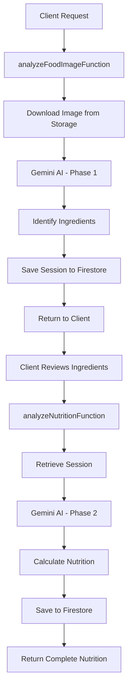
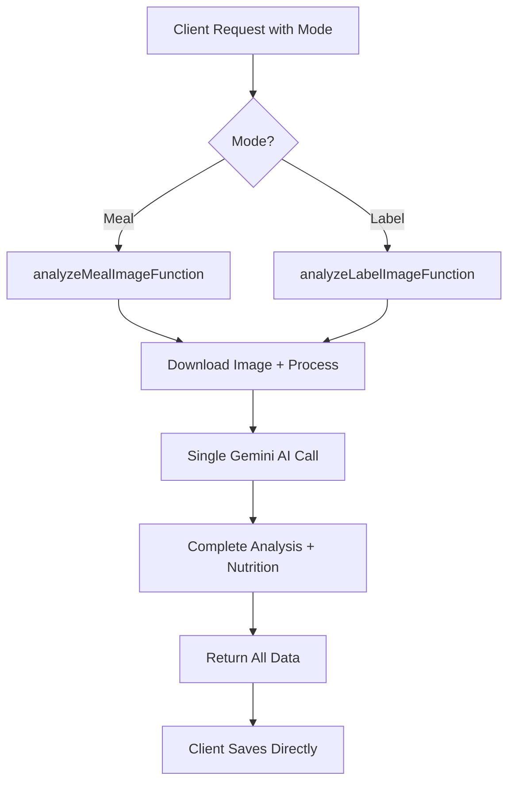

# Cloud Functions - AI Calories Analysis Flow Modification

## 📊 Current Flow vs New Flow Comparison

### **BEFORE: Two-Phase Analysis System**



**Time:** 15-25 seconds (excluding user review time)  
**API Calls:** 2 separate Firebase Functions  
**AI Invocations:** 2 Gemini API calls  
**Session Management:** Required between phases  

### **AFTER: Single-Phase Analysis System**



**Time:** 8-12 seconds  
**API Calls:** 1 Firebase Function  
**AI Invocations:** 1 Gemini API call  
**Session Management:** Not required  

---

## 🚀 Step-by-Step Implementation Guide

### **Phase 1: Project Setup & Dependencies**

#### Step 1.1: Update Dependencies
```bash
cd functions
npm install zod@latest @google-cloud/storage@latest
```

#### Step 1.2: Create New File Structure
```bash
# Create new files
touch src/food/analyzeMealImage.ts
touch src/food/analyzeLabel.ts
touch src/shared/unifiedSchemas.ts
touch src/shared/unifiedPrompts.ts
```

---

### **Phase 2: Create Unified Schemas**

#### Step 2.1: Create `src/shared/unifiedSchemas.ts`
```typescript
import { z } from 'zod';

// Food validity assessment
export const FoodValiditySchema = z.object({
  score: z.number().min(0).max(1),
  isFood: z.boolean(),
  warningMessage: z.string().optional(),
  category: z.enum(['meal', 'packaged_food', 'beverage', 'non_food', 'unclear'])
});

// Unified nutrition response
export const UnifiedNutritionSchema = z.object({
  calories: z.number().min(0),
  protein: z.number().min(0),
  carbohydrates: z.number().min(0),
  fat: z.number().min(0),
  fiber: z.number().min(0).optional(),
  sugar: z.number().min(0).optional(),
  sodium: z.number().min(0).optional()
});

// Simplified ingredient for reference
export const SimpleIngredientSchema = z.object({
  name: z.string(),
  quantity: z.number(),
  unit: z.string(),
  calories: z.number()
});

// Complete unified response
export const UnifiedAnalysisResponseSchema = z.object({
  success: z.boolean(),
  sessionId: z.string(),
  mode: z.enum(['meal', 'label']),
  
  // Core results
  mealName: z.string(),
  nutrition: UnifiedNutritionSchema,
  
  // Confidence metrics
  confidence: z.number().min(0).max(1),
  foodValidity: FoodValiditySchema,
  
  // Supporting data
  ingredients: z.array(SimpleIngredientSchema).optional(),
  servingSize: z.string().optional(),
  servingsAnalyzed: z.number().default(1),
  
  // Metadata
  processingTime: z.number(),
  model: z.string(),
  language: z.string(),
  unitSystem: z.enum(['metric', 'imperial']),
  userNotes: z.string().optional(),
  
  // Warnings/Info
  warnings: z.array(z.string()).optional(),
  suggestions: z.array(z.string()).optional()
});

export type UnifiedAnalysisResponse = z.infer<typeof UnifiedAnalysisResponseSchema>;
```

---

### **Phase 3: Create Unified Prompts**

#### Step 3.1: Create `src/shared/unifiedPrompts.ts`
```typescript
export const getMealAnalysisPrompt = (
  language: string,
  unitSystem: string,
  userNotes?: string
) => {
  const notesSection = userNotes 
    ? `\nUSER PROVIDED CONTEXT: "${userNotes}"\nUse this information to improve accuracy.\n` 
    : '';

  return `You are an expert nutritionist and food analyst with computer vision capabilities.

TASK: Analyze this food image and provide complete nutrition information in a SINGLE response.

${notesSection}

ANALYSIS REQUIREMENTS:
1. FOOD VALIDATION (Critical)
   - Determine if this is actually food (foodValidity.score: 0.0-1.0)
   - Score < 0.25: Not food (provide warning)
   - Score 0.25-0.75: Possibly food (provide context)
   - Score > 0.75: Definitely food
   - Categories: meal, packaged_food, beverage, non_food, unclear

2. MEAL IDENTIFICATION
   - Identify the meal/dish name
   - List all visible ingredients with estimated quantities
   - Consider cooking methods (fried adds 10-15% calories, etc.)
   - Account for hidden ingredients (oil, butter, sauces)

3. PORTION ESTIMATION
   - Use visual cues: plate size, utensils, hand comparisons
   - Standard portions: 
     * Protein: palm-sized = ~100-150g
     * Rice/pasta: fist-sized = ~150-200g
     * Vegetables: two hands cupped = ~150-200g
   - Adjust based on ${unitSystem} system

4. NUTRITION CALCULATION
   - Calculate total calories, protein, carbs, fat
   - Include fiber, sugar, sodium if identifiable
   - Per-ingredient breakdown for transparency
   - Apply cooking method adjustments

5. CONFIDENCE SCORING
   - Overall confidence: 0.0-1.0
   - Consider image clarity, portion visibility, ingredient certainty
   - Lower confidence for partially visible or complex mixed dishes

LANGUAGE: Respond in ${language}
UNITS: Use ${unitSystem} system (g/ml for metric, oz/cups for imperial)

IMPORTANT VALIDATIONS:
- Realistic calorie ranges: 50-2000 per meal
- Protein: 0-200g per meal
- Carbs: 0-300g per meal  
- Fat: 0-150g per meal
- If values exceed these, add warning

Return structured JSON matching the schema exactly.`;
};

export const getLabelAnalysisPrompt = (
  language: string,
  unitSystem: string,
  userNotes?: string
) => {
  const notesSection = userNotes 
    ? `\nADDITIONAL CONTEXT: "${userNotes}"\n` 
    : '';

  return `You are an expert at reading and analyzing nutrition labels using OCR and image recognition.

TASK: Extract nutrition information from this food label image.

${notesSection}

EXTRACTION REQUIREMENTS:
1. LABEL VALIDATION
   - Determine if this is a nutrition label (foodValidity.score)
   - Assess readability and completeness
   - Flag if label is partially visible or blurry

2. NUTRITION FACTS EXTRACTION
   - Serving size and servings per container
   - Calories per serving
   - Macronutrients: protein, carbs, fat
   - Micronutrients if visible: fiber, sugar, sodium, vitamins
   - Ingredients list if visible

3. CALCULATION ADJUSTMENTS
   - If user notes mention portion (e.g., "half package"), adjust accordingly
   - Convert between serving sizes if needed
   - Handle multiple serving consumption

4. ACCURACY ASSESSMENT
   - Confidence score based on label clarity
   - Flag any unclear or estimated values
   - Note if any key information is missing

LANGUAGE: Respond in ${language}
UNITS: Convert to ${unitSystem} if needed

VALIDATION RULES:
- Check for realistic values
- Flag if calories don't match macros (protein*4 + carbs*4 + fat*9)
- Ensure serving sizes make sense

Return structured JSON with complete nutrition data.`;
};
```

---

### **Phase 4: Implement New Cloud Functions**

#### Step 4.1: Create `src/food/analyzeMealImage.ts`
```typescript
import * as functions from 'firebase-functions';
import { GoogleGenerativeAI } from '@google/generative-ai';
import { Storage } from '@google-cloud/storage';
import { UnifiedAnalysisResponseSchema } from '../shared/unifiedSchemas';
import { getMealAnalysisPrompt } from '../shared/unifiedPrompts';
import { validateAuth, downloadImage, generateSessionId } from '../shared/utils';
import * as admin from 'firebase-admin';

const genAI = new GoogleGenerativeAI(process.env.GEMINI_API_KEY!);
const storage = new Storage();

export const analyzeMealImageFunction = functions
  .region('europe-west1')
  .runWith({
    timeoutSeconds: 120,
    memory: '1GB',
  })
  .https.onCall(async (data, context) => {
    const startTime = Date.now();
    
    try {
      // 1. Validate authentication
      const userId = await validateAuth(context);
      
      // 2. Validate input
      const { storagePath, language = 'English', unitSystem = 'metric', notes = '' } = data;
      
      if (!storagePath) {
        throw new functions.https.HttpsError(
          'invalid-argument',
          'Storage path is required'
        );
      }
      
      // 3. Download image from Firebase Storage
      const imageBuffer = await downloadImage(storagePath);
      const imageBase64 = imageBuffer.toString('base64');
      
      // 4. Prepare AI model with structured output
      const model = genAI.getGenerativeModel({
        model: 'gemini-1.5-flash',
        generationConfig: {
          responseMimeType: 'application/json',
          responseSchema: UnifiedAnalysisResponseSchema,
        },
      });
      
      // 5. Generate prompt
      const prompt = getMealAnalysisPrompt(language, unitSystem, notes);
      
      // 6. Analyze image with single AI call
      const result = await model.generateContent([
        prompt,
        {
          inlineData: {
            mimeType: 'image/jpeg',
            data: imageBase64,
          },
        },
      ]);
      
      const response = result.response;
      const analysisData = JSON.parse(response.text());
      
      // 7. Enhance response with metadata
      const sessionId = generateSessionId();
      const enhancedResponse = {
        ...analysisData,
        success: true,
        sessionId,
        mode: 'meal',
        processingTime: Date.now() - startTime,
        model: 'gemini-1.5-flash',
        language,
        unitSystem,
        userNotes: notes,
      };
      
      // 8. Validate response with schema
      const validatedResponse = UnifiedAnalysisResponseSchema.parse(enhancedResponse);
      
      // 9. Log analysis for monitoring (optional)
      await admin.firestore()
        .collection('aiAnalysisLogs')
        .doc(sessionId)
        .set({
          userId,
          timestamp: admin.firestore.FieldValue.serverTimestamp(),
          mode: 'meal',
          foodValidityScore: validatedResponse.foodValidity.score,
          confidence: validatedResponse.confidence,
          calories: validatedResponse.nutrition.calories,
          processingTime: validatedResponse.processingTime,
          hasWarnings: (validatedResponse.warnings?.length ?? 0) > 0,
        });
      
      // 10. Check for low food validity and add warning
      if (validatedResponse.foodValidity.score < 0.25) {
        validatedResponse.warnings = [
          ...(validatedResponse.warnings || []),
          'Low confidence this is food. Please ensure you are photographing actual food items.',
        ];
      }
      
      return validatedResponse;
      
    } catch (error: any) {
      console.error('Meal analysis error:', error);
      
      // Structured error response
      if (error.code === 'resource-exhausted') {
        throw new functions.https.HttpsError(
          'resource-exhausted',
          'AI analysis quota exceeded. Please try again later.'
        );
      }
      
      throw new functions.https.HttpsError(
        'internal',
        error.message || 'Failed to analyze meal image'
      );
    }
  });
```

#### Step 4.2: Create `src/food/analyzeLabel.ts`
```typescript
import * as functions from 'firebase-functions';
import { GoogleGenerativeAI } from '@google/generative-ai';
import { Storage } from '@google-cloud/storage';
import { UnifiedAnalysisResponseSchema } from '../shared/unifiedSchemas';
import { getLabelAnalysisPrompt } from '../shared/unifiedPrompts';
import { validateAuth, downloadImage, generateSessionId } from '../shared/utils';
import * as admin from 'firebase-admin';

const genAI = new GoogleGenerativeAI(process.env.GEMINI_API_KEY!);
const storage = new Storage();

export const analyzeLabelImageFunction = functions
  .region('europe-west1')
  .runWith({
    timeoutSeconds: 120,
    memory: '1GB',
  })
  .https.onCall(async (data, context) => {
    const startTime = Date.now();
    
    try {
      // 1. Validate authentication
      const userId = await validateAuth(context);
      
      // 2. Validate input
      const { storagePath, language = 'English', unitSystem = 'metric', notes = '' } = data;
      
      if (!storagePath) {
        throw new functions.https.HttpsError(
          'invalid-argument',
          'Storage path is required'
        );
      }
      
      // 3. Download image
      const imageBuffer = await downloadImage(storagePath);
      const imageBase64 = imageBuffer.toString('base64');
      
      // 4. Prepare AI model
      const model = genAI.getGenerativeModel({
        model: 'gemini-1.5-flash',
        generationConfig: {
          responseMimeType: 'application/json',
          responseSchema: UnifiedAnalysisResponseSchema,
        },
      });
      
      // 5. Generate label-specific prompt
      const prompt = getLabelAnalysisPrompt(language, unitSystem, notes);
      
      // 6. Analyze label
      const result = await model.generateContent([
        prompt,
        {
          inlineData: {
            mimeType: 'image/jpeg',
            data: imageBase64,
          },
        },
      ]);
      
      const response = result.response;
      const analysisData = JSON.parse(response.text());
      
      // 7. Enhance response
      const sessionId = generateSessionId();
      const enhancedResponse = {
        ...analysisData,
        success: true,
        sessionId,
        mode: 'label',
        processingTime: Date.now() - startTime,
        model: 'gemini-1.5-flash',
        language,
        unitSystem,
        userNotes: notes,
      };
      
      // 8. Validate response
      const validatedResponse = UnifiedAnalysisResponseSchema.parse(enhancedResponse);
      
      // 9. Log for monitoring
      await admin.firestore()
        .collection('aiAnalysisLogs')
        .doc(sessionId)
        .set({
          userId,
          timestamp: admin.firestore.FieldValue.serverTimestamp(),
          mode: 'label',
          labelReadability: validatedResponse.foodValidity.score,
          confidence: validatedResponse.confidence,
          calories: validatedResponse.nutrition.calories,
          processingTime: validatedResponse.processingTime,
        });
      
      // 10. Add warnings for poor label quality
      if (validatedResponse.foodValidity.score < 0.5) {
        validatedResponse.warnings = [
          ...(validatedResponse.warnings || []),
          'Label may be partially obscured or unclear. Results might be estimated.',
        ];
      }
      
      return validatedResponse;
      
    } catch (error: any) {
      console.error('Label analysis error:', error);
      
      throw new functions.https.HttpsError(
        'internal',
        error.message || 'Failed to analyze nutrition label'
      );
    }
  });
```

---

### **Phase 5: Update Index File**

#### Step 5.1: Modify `src/index.ts`
```typescript
import * as admin from 'firebase-admin';

// Initialize Firebase Admin
admin.initializeApp();

// Import new functions
export { analyzeMealImageFunction } from './food/analyzeMealImage';
export { analyzeLabelImageFunction } from './food/analyzeLabel';

// Mark old functions as deprecated (keep temporarily for rollback)
export { analyzeFoodImageFunction as deprecatedAnalyzeFoodImage } from './food/analyzeFoodImage';
export { analyzeNutritionFunction as deprecatedAnalyzeNutrition } from './food/analyzeNutrition';
```

---

### **Phase 6: Testing & Deployment**

#### Step 6.1: Create Test Script
```typescript
// test/testUnifiedAnalysis.ts
import { analyzeMealImageFunction } from '../src/food/analyzeMealImage';

async function testMealAnalysis() {
  const testData = {
    storagePath: 'test-images/pizza.jpg',
    language: 'English',
    unitSystem: 'metric',
    notes: 'Large pepperoni pizza, about 14 inches',
  };
  
  const context = {
    auth: { uid: 'test-user-id' },
  };
  
  try {
    const result = await analyzeMealImageFunction(testData, context);
    console.log('Analysis successful:', result);
    
    // Validate key fields
    assert(result.success === true);
    assert(result.nutrition.calories > 0);
    assert(result.foodValidity.score > 0);
    assert(result.mode === 'meal');
    
    console.log('✅ All tests passed');
  } catch (error) {
    console.error('❌ Test failed:', error);
  }
}
```

#### Step 6.2: Deploy Functions
```bash
# Deploy only new functions first
firebase deploy --only functions:analyzeMealImageFunction,functions:analyzeLabelImageFunction

# Test in staging
npm run test:staging

# If successful, update production
firebase deploy --only functions --project production
```

---

### **Phase 7: Migration & Cleanup**

#### Step 7.1: Monitor Usage
```typescript
// Add monitoring to track migration
const monitoringQuery = admin.firestore()
  .collection('aiAnalysisLogs')
  .where('timestamp', '>=', new Date('2024-01-01'))
  .orderBy('timestamp', 'desc');

// Check adoption of new functions vs old
```

#### Step 7.2: Gradual Deprecation
```typescript
// After 2 weeks, add deprecation warnings to old functions
export const analyzeFoodImageFunction = functions
  .https.onCall(async (data, context) => {
    console.warn('DEPRECATED: Use analyzeMealImageFunction instead');
    // Original implementation...
  });
```

#### Step 7.3: Final Cleanup (After 30 days)
```bash
# Remove old functions
rm src/food/analyzeFoodImage.ts
rm src/food/analyzeNutrition.ts
rm src/food/saveMealEntry.ts

# Update index.ts to remove exports
# Deploy final version
firebase deploy --only functions
```

---

## 📊 Performance Metrics to Track

### Key Metrics
1. **Response Time**: Target < 10s (currently 15-25s)
2. **Success Rate**: > 95%
3. **Food Validity Accuracy**: < 5% false positives
4. **Token Usage**: 50% reduction
5. **Error Rate**: < 2%

### Monitoring Dashboard
```javascript
// CloudFunction Metrics to track
{
  functionName: 'analyzeMealImageFunction',
  averageLatency: 8500, // ms
  successRate: 0.97,
  dailyInvocations: 1250,
  averageTokensUsed: 2500,
  foodValidityWarnings: 0.03, // 3% of requests
  errorRate: 0.02
}
```

---

## 🔄 Rollback Plan

If issues occur, rollback strategy:

1. **Immediate**: Route traffic back to old functions via client flag
2. **Fix Forward**: Deploy hotfix to new functions
3. **Full Rollback**: Restore old function names in index.ts
4. **Data Recovery**: All sessions logged, can replay if needed

---

## ✅ Success Criteria

- [ ] Single API call completes in < 12 seconds
- [ ] Food validity detection accuracy > 95%
- [ ] Token usage reduced by 40-50%
- [ ] No increase in error rates
- [ ] Client integration seamless
- [ ] Monitoring dashboard operational