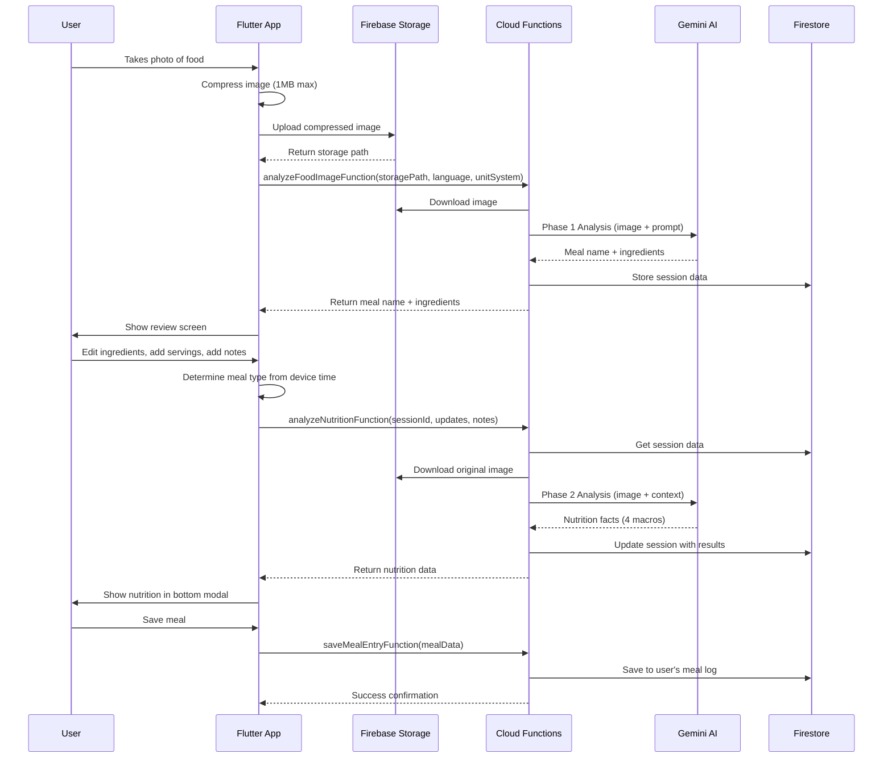

# AI Food Detection System - Complete Implementation Guide

## 📋 Table of Contents

1. [System Overview](#system-overview)
2. [Architecture & Data Flow](#architecture--data-flow)
3. [Phase 1: Food Image Analysis](#phase-1-food-image-analysis)
4. [User Review Interface](#user-review-interface)
5. [Phase 2: Nutrition Analysis](#phase-2-nutrition-analysis)
6. [Flutter Implementation](#flutter-implementation)
7. [Cloud Functions Implementation](#cloud-functions-implementation)
8. [Data Models & Schemas](#data-models--schemas)
9. [Error Handling & Recovery](#error-handling--recovery)
10. [Performance Optimization](#performance-optimization)
11. [Testing Strategy](#testing-strategy)

---

## System Overview

### **Core Functionality**
The AI Food Detection system enables users to log meals by taking photos, with AI-powered ingredient identification and nutrition analysis. The system is designed for accuracy, speed, and simplicity.

### **Key Requirements**
- **Phase 1**: Image → Meal name + ingredients list (in user's language)
- **Phase 2**: Image + user context → 4 essential macros (calories, protein, carbs, fat)
- **User Control**: Full editing capability for ingredients and portions
- **Localization**: Support for multiple languages and unit systems
- **Simplicity**: Focus only on essential nutrition data

### **Technology Stack**
- **Frontend**: Flutter with Cubit state management
- **Backend**: Firebase Cloud Functions v2
- **AI Model**: Google Gemini 2.0 Flash Exp (vision) + 2.5 Flash (text)
- **Storage**: Firebase Storage for images
- **Database**: Firestore for session management
- **Image Processing**: Client-side compression

---

## Architecture & Data Flow

### **Complete User Journey**



### **Data Flow Architecture**

```
📱 Flutter Client
    ↓ Image Upload
🗄️ Firebase Storage
    ↓ Storage Path
☁️ Cloud Functions
    ↓ AI Analysis  
🤖 Gemini AI
    ↓ Results
🔥 Firestore (Session Storage)
    ↓ Final Save
💾 User Meal Database
```

---

## Phase 1: Food Image Analysis

### **Objective**
Analyze food image to identify meal name and ingredients with estimated portions in user's preferred language and unit system.

### **Cloud Function: analyzeFoodImageFunction**

```typescript
// analyzeFoodImageFunction.ts
import { onCall } from 'firebase-functions/v2/https';
import { GoogleGenAI } from '@google/genai';
import * as admin from 'firebase-admin';
import { defineSecret } from 'firebase-functions/params';

const apiKey = defineSecret('GEMINI_API_KEY');

export const analyzeFoodImageFunction = onCall({
  region: 'europe-west1',
  timeoutSeconds: 90,
  memory: '1GiB',
  secrets: [apiKey],
  enforceAppCheck: false,
}, async (request) => {
  const startTime = Date.now();
  const { storagePath, language, unitSystem } = request.data;
  const userId = request.auth?.uid;
  
  if (!userId) {
    throw new Error('Authentication required');
  }
  
  console.log(`[${userId}] Starting Phase 1 analysis: ${storagePath}`);
  
  try {
    // 1. Download image from Firebase Storage
    const bucket = admin.storage().bucket();
    const file = bucket.file(storagePath);
    
    const [exists] = await file.exists();
    if (!exists) {
      throw new Error('Image file not found in storage');
    }
    
    const [imageBuffer] = await file.download();
    console.log(`[${userId}] Image downloaded: ${imageBuffer.length} bytes`);
    
    // 2. Build language and unit-specific prompt
    const prompt = buildFoodAnalysisPrompt(language, unitSystem);
    
    // 3. Initialize Gemini AI
    const genAI = new GoogleGenAI({ apiKey: apiKey.value() });
    
    // 4. Analyze food with structured output
    const result = await genAI.models.generateContent({
      model: 'gemini-2.0-flash-exp', // Best for vision tasks
      contents: [{
        role: 'user',
        parts: [
          { text: prompt },
          { 
            inlineData: { 
              data: imageBuffer.toString('base64'),
              mimeType: 'image/jpeg' 
            } 
          }
        ]
      }],
      config: {
        temperature: 0.3, // Lower for consistent recognition
        maxOutputTokens: 1500,
        responseSchema: FoodAnalysisSchema,
      }
    });
    
    // 5. Parse structured response
    const analysis = JSON.parse(result.text);
    console.log(`[${userId}] AI analysis completed: ${analysis.mealName}`);
    
    // 6. Generate session ID and store results
    const sessionId = `session_${Date.now()}_${Math.random().toString(36).substr(2, 9)}`;
    
    await admin.firestore()
      .collection('aiSessions')
      .doc(sessionId)
      .set({
        userId,
        sessionId,
        storagePath,
        language,
        unitSystem,
        phase: 'phase1_completed',
        phase1Results: analysis,
        createdAt: admin.firestore.FieldValue.serverTimestamp(),
        phase1ProcessingTimeMs: Date.now() - startTime,
        modelUsed: 'gemini-2.0-flash-exp',
        tokenUsage: {
          inputTokens: result.usageMetadata?.promptTokenCount || 0,
          outputTokens: result.usageMetadata?.candidatesTokenCount || 0,
          totalTokens: result.usageMetadata?.totalTokenCount || 0,
        },
      });
    
    console.log(`[${userId}] Phase 1 completed in ${Date.now() - startTime}ms`);
    
    return {
      success: true,
      sessionId,
      data: {
        mealName: analysis.mealName,
        ingredients: analysis.ingredients,
      },
      metadata: {
        processingTime: Date.now() - startTime,
        model: 'gemini-2.0-flash-exp',
        language,
        unitSystem,
      }
    };
    
  } catch (error) {
    console.error(`[${userId}] Phase 1 error:`, error);
    
    // Store error for debugging
    await admin.firestore()
      .collection('errorLogs')
      .add({
        userId,
        functionName: 'analyzeFoodImageFunction',
        error: error.message,
        storagePath,
        timestamp: admin.firestore.FieldValue.serverTimestamp(),
      });
    
    throw new Error(`Food analysis failed: ${error.message}`);
  }
});

/**
 * Build language and unit system specific prompt for food analysis
 */
function buildFoodAnalysisPrompt(language: string, unitSystem: string): string {
  // Define units based on system preference
  const metricUnits = 'grams (g), milliliters (ml), pieces, slices';
  const imperialUnits = 'ounces (oz), cups, tablespoons (tbsp), teaspoons (tsp), pieces, slices';
  const units = unitSystem === 'metric' ? metricUnits : imperialUnits;
  
  // Get language-specific instructions
  const languageInstructions = getLanguageInstructions(language);
  
  return `
${languageInstructions}

FOOD ANALYSIS TASK:
Analyze this food image and identify:
1. A descriptive meal name
2. All visible ingredients with estimated portions

PORTION ESTIMATION GUIDELINES:
- Use ${unitSystem} measurement system
- Available units: ${units}
- Be conservative with estimates (users can adjust upward)
- Use visual cues like plate size, utensil size for scale
- For solid foods, prefer weight units (g/oz)
- For liquids, use volume units (ml/cups)
- For countable items, use pieces/slices

COMMON PORTION REFERENCES:
${getPortionReferences(unitSystem)}

INGREDIENT IDENTIFICATION:
- Be specific with food names (e.g., "Grilled Chicken Breast" not "Chicken")
- Include cooking method if visible (grilled, fried, steamed, raw)
- Identify major seasonings or sauces if clearly visible
- Group similar small items (e.g., "Mixed Vegetables" for small veggie mix)

OUTPUT REQUIREMENTS:
- Meal name should be descriptive and natural in ${language}
- All ingredient names must be in ${language}
- Provide realistic portion estimates
- Include 3-8 main ingredients (avoid over-segmentation)

Return valid JSON only, no explanations or additional text.
`;
}

/**
 * Get language-specific instructions
 */
function getLanguageInstructions(language: string): string {
  const instructions = {
    'Arabic': 'أجب باللغة العربية. جميع أسماء الوجبات والمكونات يجب أن تكون باللغة العربية.',
    'English': 'Respond in English. All meal names and ingredients should be in English.',
    'Spanish': 'Responde en español. Todos los nombres de comidas e ingredientes deben estar en español.',
    'French': 'Répondez en français. Tous les noms de repas et ingrédients doivent être en français.',
    'German': 'Antworten Sie auf Deutsch. Alle Mahlzeit- und Zutatennamen müssen auf Deutsch sein.',
  };
  
  return instructions[language] || instructions['English'];
}

/**
 * Get unit-specific portion references
 */
function getPortionReferences(unitSystem: string): string {
  if (unitSystem === 'metric') {
    return `
- Meat/Fish: Palm size ≈ 120-150g
- Rice/Pasta (cooked): Fist size ≈ 150-200g
- Vegetables: Handful ≈ 80-100g
- Cheese slice: Thumb size ≈ 25-30g
- Oil/Dressing: Thumb tip ≈ 5-10ml
- Bread slice: Standard ≈ 25-30g`;
  } else {
    return `
- Meat/Fish: Palm size ≈ 4-5 oz
- Rice/Pasta (cooked): Fist size ≈ 1 cup
- Vegetables: Handful ≈ 3-4 oz
- Cheese slice: Thumb size ≈ 1 oz
- Oil/Dressing: Thumb tip ≈ 1 tsp
- Bread slice: Standard ≈ 1 slice`;
  }
}
```

### **Phase 1 JSON Schema**

```typescript
// foodSchemas.ts
import { Type } from "@google/genai";

export const FoodAnalysisSchema = {
  type: Type.OBJECT,
  properties: {
    mealName: {
      type: Type.STRING,
      description: "Descriptive name for the meal in user's language (e.g., 'Grilled Salmon with Rice')"
    },
    ingredients: {
      type: Type.ARRAY,
      description: "List of identified ingredients with portions",
      items: {
        type: Type.OBJECT,
        properties: {
          name: {
            type: Type.STRING,
            description: "Ingredient name in user's language, include cooking method if visible"
          },
          quantity: {
            type: Type.NUMBER,
            description: "Estimated quantity (conservative estimate)"
          },
          unit: {
            type: Type.STRING,
            description: "Unit of measurement based on user's preference system",
            enum: [
              // Metric units
              "g", "ml", "pieces", "slices",
              // Imperial units  
              "oz", "cups", "tbsp", "tsp"
            ]
          }
        },
        required: ["name", "quantity", "unit"],
        propertyOrdering: ["name", "quantity", "unit"]
      },
      minItems: 2,
      maxItems: 8
    }
  },
  required: ["mealName", "ingredients"],
  propertyOrdering: ["mealName", "ingredients"]
};
```

### **Phase 1 Request/Response**

**Request:**
```json
{
  "storagePath": "food_analysis/user123/session_1678901234567.jpg",
  "language": "English",
  "unitSystem": "metric"
}
```

**Response:**
```json
{
  "success": true,
  "sessionId": "session_1678901234567_abc123def",
  "data": {
    "mealName": "Grilled Chicken with Rice and Vegetables",
    "ingredients": [
      {
        "name": "Grilled Chicken Breast",
        "quantity": 150,
        "unit": "g"
      },
      {
        "name": "White Rice",
        "quantity": 200,
        "unit": "g"
      },
      {
        "name": "Mixed Vegetables",
        "quantity": 100,
        "unit": "g"
      },
      {
        "name": "Olive Oil",
        "quantity": 10,
        "unit": "ml"
      }
    ]
  },
  "metadata": {
    "processingTime": 2845,
    "model": "gemini-2.0-flash-exp",
    "language": "English",
    "unitSystem": "metric"
  }
}
```

---

## User Review Interface

### **Flutter Implementation: Ingredient Review Screen**

```dart
// ingredient_review_screen.dart
import 'package:flutter/material.dart';
import 'package:flutter_bloc/flutter_bloc.dart';

class IngredientReviewScreen extends StatefulWidget {
  final String sessionId;
  final String storagePath;
  final String initialMealName;
  final List<AnalyzedIngredient> initialIngredients;
  
  const IngredientReviewScreen({
    super.key,
    required this.sessionId,
    required this.storagePath,
    required this.initialMealName,
    required this.initialIngredients,
  });
  
  @override
  State<IngredientReviewScreen> createState() => _IngredientReviewScreenState();
}

class _IngredientReviewScreenState extends State<IngredientReviewScreen> {
  late TextEditingController _mealNameController;
  late List<IngredientController> _ingredientControllers;
  late TextEditingController _notesController;
  
  bool _isProcessing = false;
  
  @override
  void initState() {
    super.initState();
    _initializeControllers();
  }
  
  void _initializeControllers() {
    _mealNameController = TextEditingController(text: widget.initialMealName);
    _notesController = TextEditingController();
    
    _ingredientControllers = widget.initialIngredients.map((ingredient) {
      return IngredientController(
        nameController: TextEditingController(text: ingredient.name),
        quantityController: TextEditingController(text: ingredient.quantity.toString()),
        unit: ingredient.unit,
        servingAmountController: TextEditingController(text: '1.0'),
      );
    }).toList();
  }
  
  @override
  void dispose() {
    _mealNameController.dispose();
    _notesController.dispose();
    for (final controller in _ingredientControllers) {
      controller.dispose();
    }
    super.dispose();
  }
  
  void _addIngredient() {
    setState(() {
      _ingredientControllers.add(IngredientController(
        nameController: TextEditingController(),
        quantityController: TextEditingController(text: '100'),
        unit: _getDefaultUnit(),
        servingAmountController: TextEditingController(text: '1.0'),
      ));
    });
  }
  
  void _removeIngredient(int index) {
    if (_ingredientControllers.length > 1) {
      setState(() {
        _ingredientControllers[index].dispose();
        _ingredientControllers.removeAt(index);
      });
    }
  }
  
  String _getDefaultUnit() {
    final unitSystem = context.read<UserPreferencesCubit>().state.unitSystem;
    return unitSystem == UnitSystem.metric ? 'g' : 'oz';
  }
  
  List<String> _getAvailableUnits() {
    final unitSystem = context.read<UserPreferencesCubit>().state.unitSystem;
    if (unitSystem == UnitSystem.metric) {
      return ['g', 'ml', 'pieces', 'slices'];
    } else {
      return ['oz', 'cups', 'tbsp', 'tsp', 'pieces', 'slices'];
    }
  }
  
  String _determineMealTypeFromTime() {
    final hour = DateTime.now().hour;
    if (hour >= 5 && hour < 11) return 'breakfast';
    if (hour >= 11 && hour < 15) return 'lunch';
    if (hour >= 15 && hour < 18) return 'snack';
    return 'dinner';
  }
  
  Future<void> _proceedToNutritionAnalysis() async {
    if (_isProcessing) return;
    
    // Validate form
    if (_mealNameController.text.trim().isEmpty) {
      _showErrorSnackBar('Please enter a meal name');
      return;
    }
    
    bool hasValidIngredients = false;
    for (final controller in _ingredientControllers) {
      if (controller.nameController.text.trim().isNotEmpty &&
          double.tryParse(controller.quantityController.text) != null &&
          double.tryParse(controller.servingAmountController.text) != null) {
        hasValidIngredients = true;
        break;
      }
    }
    
    if (!hasValidIngredients) {
      _showErrorSnackBar('Please add at least one valid ingredient');
      return;
    }
    
    setState(() => _isProcessing = true);
    
    // Prepare ingredients data
    final ingredients = _ingredientControllers
        .where((controller) => 
            controller.nameController.text.trim().isNotEmpty &&
            double.tryParse(controller.quantityController.text) != null &&
            double.tryParse(controller.servingAmountController.text) != null)
        .map((controller) => {
          'name': controller.nameController.text.trim(),
          'quantity': double.parse(controller.quantityController.text),
          'unit': controller.unit,
          'servingAmount': double.parse(controller.servingAmountController.text),
        })
        .toList();
    
    final mealType = _determineMealTypeFromTime();
    
    try {
      // Show loading animation
      _showNutritionLoadingDialog();
      
      // Call Phase 2 analysis
      final result = await context.read<FoodAnalysisCubit>().analyzeNutrition(
        sessionId: widget.sessionId,
        storagePath: widget.storagePath,
        mealName: _mealNameController.text.trim(),
        mealType: mealType,
        ingredients: ingredients,
        notes: _notesController.text.trim(),
      );
      
      // Close loading dialog
      if (mounted) Navigator.of(context).pop();
      
      // Show nutrition results in bottom modal
      if (mounted) {
        _showNutritionBottomModal(result, mealType);
      }
      
    } catch (error) {
      // Close loading dialog
      if (mounted) Navigator.of(context).pop();
      
      _showErrorDialog(error.toString());
    } finally {
      setState(() => _isProcessing = false);
    }
  }
  
  void _showNutritionLoadingDialog() {
    showDialog(
      context: context,
      barrierDismissible: false,
      builder: (context) => const NutritionLoadingDialog(),
    );
  }
  
  void _showNutritionBottomModal(NutritionResult result, String mealType) {
    showModalBottomSheet(
      context: context,
      isScrollControlled: true,
      backgroundColor: Colors.transparent,
      builder: (context) => NutritionBottomModal(
        nutritionResult: result,
        mealName: _mealNameController.text.trim(),
        mealType: mealType,
        ingredients: _ingredientControllers
            .map((c) => ReviewedIngredient(
                  name: c.nameController.text,
                  quantity: double.tryParse(c.quantityController.text) ?? 0,
                  unit: c.unit,
                  servingAmount: double.tryParse(c.servingAmountController.text) ?? 1,
                ))
            .toList(),
        notes: _notesController.text.trim(),
        sessionId: widget.sessionId,
        storagePath: widget.storagePath,
      ),
    );
  }
  
  void _showErrorSnackBar(String message) {
    ScaffoldMessenger.of(context).showSnackBar(
      SnackBar(
        content: Text(message),
        backgroundColor: Colors.red,
      ),
    );
  }
  
  void _showErrorDialog(String error) {
    showDialog(
      context: context,
      builder: (context) => AlertDialog(
        title: const Text('Analysis Error'),
        content: Text('Failed to analyze nutrition: $error'),
        actions: [
          TextButton(
            onPressed: () => Navigator.of(context).pop(),
            child: const Text('OK'),
          ),
        ],
      ),
    );
  }
  
  @override
  Widget build(BuildContext context) {
    return Scaffold(
      appBar: AppBar(
        title: const Text('Review Ingredients'),
        actions: [
          IconButton(
            icon: const Icon(Icons.add_circle_outline),
            onPressed: _addIngredient,
            tooltip: 'Add ingredient',
          ),
        ],
      ),
      body: Column(
        children: [
          // Progress indicator
          LinearProgressIndicator(
            value: 0.5, // 50% complete (Phase 1 done, Phase 2 pending)
            backgroundColor: Colors.grey[300],
          ),
          
          Expanded(
            child: ListView(
              padding: const EdgeInsets.all(16),
              children: [
                // Meal name field
                Card(
                  child: Padding(
                    padding: const EdgeInsets.all(16),
                    child: Column(
                      crossAxisAlignment: CrossAxisAlignment.start,
                      children: [
                        Text(
                          'Meal Name',
                          style: Theme.of(context).textTheme.titleSmall,
                        ),
                        const SizedBox(height: 8),
                        TextField(
                          controller: _mealNameController,
                          decoration: InputDecoration(
                            hintText: 'Enter meal name',
                            prefixIcon: const Icon(Icons.restaurant),
                            border: OutlineInputBorder(
                              borderRadius: BorderRadius.circular(8),
                            ),
                          ),
                        ),
                      ],
                    ),
                  ),
                ),
                
                const SizedBox(height: 16),
                
                // Ingredients section
                Card(
                  child: Padding(
                    padding: const EdgeInsets.all(16),
                    child: Column(
                      crossAxisAlignment: CrossAxisAlignment.start,
                      children: [
                        Row(
                          mainAxisAlignment: MainAxisAlignment.spaceBetween,
                          children: [
                            Text(
                              'Ingredients',
                              style: Theme.of(context).textTheme.titleSmall,
                            ),
                            TextButton.icon(
                              onPressed: _addIngredient,
                              icon: const Icon(Icons.add, size: 16),
                              label: const Text('Add'),
                            ),
                          ],
                        ),
                        const SizedBox(height: 12),
                        
                        // Ingredients list
                        ...List.generate(_ingredientControllers.length, (index) {
                          return _buildIngredientCard(index);
                        }),
                      ],
                    ),
                  ),
                ),
                
                const SizedBox(height: 16),
                
                // Notes field
                Card(
                  child: Padding(
                    padding: const EdgeInsets.all(16),
                    child: Column(
                      crossAxisAlignment: CrossAxisAlignment.start,
                      children: [
                        Text(
                          'Additional Notes (Optional)',
                          style: Theme.of(context).textTheme.titleSmall,
                        ),
                        const SizedBox(height: 8),
                        TextField(
                          controller: _notesController,
                          maxLines: 3,
                          decoration: InputDecoration(
                            hintText: 'e.g., "Added olive oil", "From McDonald\'s", "Extra spicy"',
                            prefixIcon: const Icon(Icons.notes),
                            border: OutlineInputBorder(
                              borderRadius: BorderRadius.circular(8),
                            ),
                          ),
                        ),
                        const SizedBox(height: 8),
                        Text(
                          'These notes help our AI provide more accurate nutrition analysis',
                          style: Theme.of(context).textTheme.bodySmall?.copyWith(
                            color: Colors.grey[600],
                          ),
                        ),
                      ],
                    ),
                  ),
                ),
              ],
            ),
          ),
        ],
      ),
      bottomNavigationBar: Container(
        padding: const EdgeInsets.all(16),
        decoration: BoxDecoration(
          color: Theme.of(context).cardColor,
          boxShadow: [
            BoxShadow(
              color: Colors.black12,
              blurRadius: 4,
              offset: const Offset(0, -2),
            ),
          ],
        ),
        child: ElevatedButton.icon(
          onPressed: _isProcessing ? null : _proceedToNutritionAnalysis,
          icon: _isProcessing
              ? const SizedBox(
                  width: 16,
                  height: 16,
                  child: CircularProgressIndicator(strokeWidth: 2),
                )
              : const Icon(Icons.analytics),
          label: Text(_isProcessing ? 'Processing...' : 'Analyze Nutrition'),
          style: ElevatedButton.styleFrom(
            padding: const EdgeInsets.symmetric(vertical: 16),
          ),
        ),
      ),
    );
  }
  
  Widget _buildIngredientCard(int index) {
    final controller = _ingredientControllers[index];
    final canDelete = _ingredientControllers.length > 1;
    
    return Card(
      margin: const EdgeInsets.only(bottom: 12),
      child: Padding(
        padding: const EdgeInsets.all(12),
        child: Column(
          children: [
            // Ingredient name
            Row(
              children: [
                Expanded(
                  child: TextField(
                    controller: controller.nameController,
                    decoration: InputDecoration(
                      labelText: 'Ingredient ${index + 1}',
                      isDense: true,
                      border: OutlineInputBorder(
                        borderRadius: BorderRadius.circular(4),
                      ),
                    ),
                  ),
                ),
                const SizedBox(width: 8),
                IconButton(
                  onPressed: canDelete ? () => _removeIngredient(index) : null,
                  icon: Icon(
                    Icons.delete_outline,
                    color: canDelete ? Colors.red : Colors.grey,
                  ),
                  tooltip: canDelete ? 'Remove ingredient' : 'Cannot remove (minimum 1 ingredient)',
                ),
              ],
            ),
            
            const SizedBox(height: 12),
            
            // Quantity and unit
            Row(
              children: [
                Expanded(
                  flex: 2,
                  child: TextField(
                    controller: controller.quantityController,
                    keyboardType: TextInputType.number,
                    decoration: InputDecoration(
                      labelText: 'Amount',
                      isDense: true,
                      border: OutlineInputBorder(
                        borderRadius: BorderRadius.circular(4),
                      ),
                    ),
                  ),
                ),
                const SizedBox(width: 8),
                Expanded(
                  child: DropdownButtonFormField<String>(
                    value: controller.unit,
                    decoration: InputDecoration(
                      labelText: 'Unit',
                      isDense: true,
                      border: OutlineInputBorder(
                        borderRadius: BorderRadius.circular(4),
                      ),
                    ),
                    items: _getAvailableUnits().map((unit) {
                      return DropdownMenuItem(
                        value: unit,
                        child: Text(unit),
                      );
                    }).toList(),
                    onChanged: (value) {
                      setState(() {
                        controller.unit = value!;
                      });
                    },
                  ),
                ),
              ],
            ),
            
            const SizedBox(height: 12),
            
            // Serving amount
            Row(
              children: [
                const Text('How many servings did you eat?'),
                const SizedBox(width: 16),
                Expanded(
                  child: TextField(
                    controller: controller.servingAmountController,
                    keyboardType: const TextInputType.numberWithOptions(decimal: true),
                    decoration: InputDecoration(
                      hintText: '1.0',
                      isDense: true,
                      border: OutlineInputBorder(
                        borderRadius: BorderRadius.circular(4),
                      ),
                    ),
                  ),
                ),
                const SizedBox(width: 8),
                const Text('servings'),
              ],
            ),
          ],
        ),
      ),
    );
  }
}

/**
 * Controller class for managing ingredient input fields
 */
class IngredientController {
  final TextEditingController nameController;
  final TextEditingController quantityController;
  final TextEditingController servingAmountController;
  String unit;
  
  IngredientController({
    required this.nameController,
    required this.quantityController,
    required this.servingAmountController,
    required this.unit,
  });
  
  void dispose() {
    nameController.dispose();
    quantityController.dispose();
    servingAmountController.dispose();
  }
}

/**
 * Data models for ingredients
 */
class AnalyzedIngredient {
  final String name;
  final double quantity;
  final String unit;
  
  const AnalyzedIngredient({
    required this.name,
    required this.quantity,
    required this.unit,
  });
  
  factory AnalyzedIngredient.fromJson(Map<String, dynamic> json) {
    return AnalyzedIngredient(
      name: json['name'] as String,
      quantity: (json['quantity'] as num).toDouble(),
      unit: json['unit'] as String,
    );
  }
}

class ReviewedIngredient {
  final String name;
  final double quantity;
  final String unit;
  final double servingAmount;
  
  const ReviewedIngredient({
    required this.name,
    required this.quantity,
    required this.unit,
    required this.servingAmount,
  });
  
  Map<String, dynamic> toJson() {
    return {
      'name': name,
      'quantity': quantity,
      'unit': unit,
      'servingAmount': servingAmount,
    };
  }
}
```

### **Loading Animation Dialog**

```dart
// nutrition_loading_dialog.dart
import 'package:flutter/material.dart';
import 'package:lottie/lottie.dart';

class NutritionLoadingDialog extends StatelessWidget {
  const NutritionLoadingDialog({super.key});
  
  @override
  Widget build(BuildContext context) {
    return Dialog(
      backgroundColor: Colors.transparent,
      child: Container(
        padding: const EdgeInsets.all(24),
        decoration: BoxDecoration(
          color: Theme.of(context).cardColor,
          borderRadius: BorderRadius.circular(16),
        ),
        child: Column(
          mainAxisSize: MainAxisSize.min,
          children: [
            // Cool animation - you can replace with your pixel art animation
            SizedBox(
              height: 120,
              width: 120,
              child: Stack(
                alignment: Alignment.center,
                children: [
                  // Rotating circle
                  TweenAnimationBuilder(
                    duration: const Duration(seconds: 2),
                    tween: Tween<double>(begin: 0, end: 1),
                    builder: (context, double value, child) {
                      return Transform.rotate(
                        angle: value * 2 * 3.14159,
                        child: Container(
                          width: 80,
                          height: 80,
                          decoration: BoxDecoration(
                            shape: BoxShape.circle,
                            border: Border.all(
                              color: Theme.of(context).primaryColor,
                              width: 3,
                            ),
                            gradient: LinearGradient(
                              colors: [
                                Theme.of(context).primaryColor,
                                Theme.of(context).primaryColor.withOpacity(0.3),
                              ],
                            ),
                          ),
                        ),
                      );
                    },
                    onEnd: () {
                      // Loop animation
                    },
                  ),
                  // Food emoji
                  const Text(
                    '🍽️',
                    style: TextStyle(fontSize: 32),
                  ),
                ],
              ),
            ),
            
            const SizedBox(height: 24),
            
            Text(
              'Analyzing Micronutrients',
              style: Theme.of(context).textTheme.titleLarge?.copyWith(
                fontWeight: FontWeight.bold,
              ),
              textAlign: TextAlign.center,
            ),
            
            const SizedBox(height: 8),
            
            Text(
              'Our AI is examining your meal to calculate precise nutrition facts',
              style: Theme.of(context).textTheme.bodyMedium?.copyWith(
                color: Colors.grey[600],
              ),
              textAlign: TextAlign.center,
            ),
            
            const SizedBox(height: 24),
            
            // Progress indicator
            LinearProgressIndicator(
              backgroundColor: Colors.grey[300],
              valueColor: AlwaysStoppedAnimation<Color>(
                Theme.of(context).primaryColor,
              ),
            ),
            
            const SizedBox(height: 16),
            
            Row(
              mainAxisAlignment: MainAxisAlignment.center,
              children: [
                Icon(
                  Icons.psychology,
                  size: 16,
                  color: Colors.grey[600],
                ),
                const SizedBox(width: 8),
                Text(
                  'Powered by Gemini AI',
                  style: Theme.of(context).textTheme.bodySmall?.copyWith(
                    color: Colors.grey[600],
                  ),
                ),
              ],
            ),
          ],
        ),
      ),
    );
  }
}
```

---

## Phase 2: Nutrition Analysis

### **Cloud Function: analyzeNutritionFunction**

```typescript
// analyzeNutritionFunction.ts
export const analyzeNutritionFunction = onCall({
  region: 'europe-west1',
  timeoutSeconds: 120,
  memory: '1GiB',
  secrets: [apiKey],
  enforceAppCheck: false,
}, async (request) => {
  const startTime = Date.now();
  const { 
    sessionId, 
    mealName, 
    mealType,
    ingredients, 
    notes 
  } = request.data;
  const userId = request.auth?.uid;
  
  if (!userId) {
    throw new Error('Authentication required');
  }
  
  console.log(`[${userId}] Starting Phase 2 analysis: ${sessionId}`);
  
  try {
    // 1. Validate session and get session data
    const sessionDoc = await admin.firestore()
      .collection('aiSessions')
      .doc(sessionId)
      .get();
    
    if (!sessionDoc.exists) {
      throw new Error('Analysis session not found. Please start over.');
    }
    
    const sessionData = sessionDoc.data()!;
    const { storagePath, language } = sessionData;
    
    // 2. Download original image for analysis
    const bucket = admin.storage().bucket();
    const file = bucket.file(storagePath);
    
    const [exists] = await file.exists();
    if (!exists) {
      throw new Error('Original image not found. Please start over.');
    }
    
    const [imageBuffer] = await file.download();
    console.log(`[${userId}] Image retrieved for Phase 2: ${imageBuffer.length} bytes`);
    
    // 3. Build comprehensive nutrition analysis prompt
    const nutritionPrompt = buildNutritionAnalysisPrompt({
      language,
      mealName,
      mealType,
      ingredients,
      notes,
      phase1Results: sessionData.phase1Results,
    });
    
    // 4. Call Gemini with image + enhanced context
    const genAI = new GoogleGenAI({ apiKey: apiKey.value() });
    
    const result = await genAI.models.generateContent({
      model: 'gemini-2.0-flash-exp', // Use vision model for image analysis
      contents: [{
        role: 'user',
        parts: [
          { text: nutritionPrompt },
          { 
            inlineData: { 
              data: imageBuffer.toString('base64'),
              mimeType: 'image/jpeg' 
            } 
          }
        ]
      }],
      config: {
        temperature: 0.2, // Very low for consistent nutrition calculations
        maxOutputTokens: 1000,
        responseSchema: NutritionAnalysisSchema,
      }
    });
    
    // 5. Parse nutrition data
    const nutritionData = JSON.parse(result.text);
    console.log(`[${userId}] Nutrition analysis completed: ${nutritionData.nutrition.calories} calories`);
    
    // 6. Store Phase 2 results
    await admin.firestore()
      .collection('aiSessions')
      .doc(sessionId)
      .update({
        phase: 'phase2_completed',
        phase2Results: nutritionData,
        finalMealName: mealName,
        finalMealType: mealType,
        finalIngredients: ingredients,
        notes: notes || '',
        phase2ProcessingTimeMs: Date.now() - startTime,
        completedAt: admin.firestore.FieldValue.serverTimestamp(),
        totalProcessingTimeMs: admin.firestore.FieldValue.increment(Date.now() - startTime),
      });
    
    console.log(`[${userId}] Phase 2 completed in ${Date.now() - startTime}ms`);
    
    return {
      success: true,
      data: {
        nutrition: nutritionData.nutrition,
        confidence: nutritionData.confidence,
      },
      metadata: {
        sessionId,
        processingTime: Date.now() - startTime,
        model: 'gemini-2.0-flash-exp',
      }
    };
    
  } catch (error) {
    console.error(`[${userId}] Phase 2 error:`, error);
    
    // Store error for debugging
    await admin.firestore()
      .collection('errorLogs')
      .add({
        userId,
        functionName: 'analyzeNutritionFunction',
        sessionId,
        error: error.message,
        timestamp: admin.firestore.FieldValue.serverTimestamp(),
      });
    
    // Update session with error
    await admin.firestore()
      .collection('aiSessions')
      .doc(sessionId)
      .update({
        phase: 'phase2_failed',
        phase2Error: error.message,
        failedAt: admin.firestore.FieldValue.serverTimestamp(),
      });
    
    throw new Error(`Nutrition analysis failed: ${error.message}`);
  }
});

/**
 * Build comprehensive nutrition analysis prompt
 */
function buildNutritionAnalysisPrompt(data: {
  language: string;
  mealName: string;
  mealType: string;
  ingredients: any[];
  notes: string;
  phase1Results: any;
}): string {
  const { language, mealName, mealType, ingredients, notes, phase1Results } = data;
  
  return `
${getLanguageInstructions(language)}

NUTRITION ANALYSIS TASK:
Calculate accurate nutrition facts for this meal using the image as PRIMARY SOURCE.

MEAL INFORMATION:
Name: ${mealName}
Type: ${mealType}
Original AI Analysis: ${phase1Results.mealName} (confidence reference)

USER-CONFIRMED INGREDIENTS:
${ingredients.map(ing => 
  `- ${ing.name}: ${ing.quantity}${ing.unit} × ${ing.servingAmount} servings = ${(ing.quantity * ing.servingAmount).toFixed(1)}${ing.unit} total`
).join('\n')}

${notes ? `ADDITIONAL CONTEXT: ${notes}` : 'No additional notes provided.'}

ANALYSIS INSTRUCTIONS:
1. PRIMARY SOURCE: Use the IMAGE as your main reference
2. INGREDIENT CONTEXT: Use the confirmed ingredient list to enhance accuracy
3. USER NOTES: Consider cooking methods, restaurant info, or modifications mentioned
4. VISUAL CUES: Account for visible cooking methods (grilled, fried, steamed)
5. PORTION VALIDATION: Cross-check portions shown in image with user quantities

NUTRITION CALCULATION REQUIREMENTS:
Calculate ONLY these 4 essential macronutrients:
- Calories (total kilocalories)
- Protein (grams)
- Carbohydrates (grams, including sugars and fiber)
- Fat (grams, including all fats)

CALCULATION GUIDELINES:
- Use USDA nutrition database standards as baseline
- Adjust for visible cooking methods:
  * Fried foods: Add 10-15% calories from oil absorption
  * Grilled/baked: Account for moisture loss, no oil addition
  * Raw foods: Use standard database values
- Account for hidden ingredients visible in image (oils, sauces, seasonings)
- Consider restaurant/fast food if mentioned (higher sodium, oils)
- Be conservative but realistic with calorie estimates

PORTION ACCURACY:
- Cross-reference image portions with user-specified quantities
- Use plate size, utensils, and other objects for scale reference
- If portions in image don't match user input, favor what you see in the image

CONFIDENCE SCORING:
- High confidence (0.8-1.0): Clear image, standard foods, matches database well
- Medium confidence (0.6-0.8): Some ambiguity in portions or preparation
- Lower confidence (0.4-0.6): Poor image quality or unusual preparation

Return accurate nutrition data with honest confidence assessment.
`;
}

/**
 * Get language-specific response instructions for nutrition
 */
function getNutritionLanguageInstructions(language: string): string {
  const instructions = {
    'Arabic': 'احسب القيم الغذائية بدقة. يجب أن تكون جميع الاستجابات والحسابات باللغة العربية.',
    'English': 'Calculate nutrition values accurately. All responses and calculations should be in English.',
    'Spanish': 'Calcule los valores nutricionales con precisión. Todas las respuestas y cálculos deben estar en español.',
    'French': 'Calculez les valeurs nutritionnelles avec précision. Toutes les réponses et calculs doivent être en français.',
    'German': 'Berechnen Sie die Nährwerte genau. Alle Antworten und Berechnungen müssen auf Deutsch erfolgen.',
  };
  
  return instructions[language] || instructions['English'];
}
```

### **Phase 2 JSON Schema**

```typescript
// Simplified nutrition schema - only 4 macros
export const NutritionAnalysisSchema = {
  type: Type.OBJECT,
  properties: {
    nutrition: {
      type: Type.OBJECT,
      description: "Essential macronutrient values",
      properties: {
        calories: {
          type: Type.NUMBER,
          description: "Total calories (kcal)"
        },
        protein: {
          type: Type.NUMBER,
          description: "Protein content in grams"
        },
        carbohydrates: {
          type: Type.NUMBER,
          description: "Total carbohydrates in grams (including sugars and fiber)"
        },
        fat: {
          type: Type.NUMBER,
          description: "Total fat content in grams"
        }
      },
      required: ["calories", "protein", "carbohydrates", "fat"],
      propertyOrdering: ["calories", "protein", "carbohydrates", "fat"]
    },
    confidence: {
      type: Type.NUMBER,
      description: "Analysis confidence score from 0.0 to 1.0"
    }
  },
  required: ["nutrition", "confidence"],
  propertyOrdering: ["nutrition", "confidence"]
};
```

### **Phase 2 Request/Response**

**Request:**
```json
{
  "sessionId": "session_1678901234567_abc123def",
  "mealName": "Grilled Chicken with Rice and Vegetables",
  "mealType": "lunch",
  "ingredients": [
    {
      "name": "Grilled Chicken Breast",
      "quantity": 150,
      "unit": "g",
      "servingAmount": 1.0
    },
    {
      "name": "White Rice",
      "quantity": 200,
      "unit": "g",
      "servingAmount": 1.0
    },
    {
      "name": "Mixed Vegetables",
      "quantity": 100,
      "unit": "g",
      "servingAmount": 1.0
    },
    {
      "name": "Olive Oil",
      "quantity": 10,
      "unit": "ml",
      "servingAmount": 1.0
    }
  ],
  "notes": "Grilled without additional oil, vegetables were steamed"
}
```

**Response:**
```json
{
  "success": true,
  "data": {
    "nutrition": {
      "calories": 485,
      "protein": 35.2,
      "carbohydrates": 52.1,
      "fat": 12.8
    },
    "confidence": 0.87
  },
  "metadata": {
    "sessionId": "session_1678901234567_abc123def",
    "processingTime": 2156,
    "model": "gemini-2.0-flash-exp"
  }
}
```

---

## Flutter Implementation

### **Nutrition Results Bottom Modal**

```dart
// nutrition_bottom_modal.dart
import 'package:flutter/material.dart';
import 'package:flutter_bloc/flutter_bloc.dart';

class NutritionBottomModal extends StatelessWidget {
  final NutritionResult nutritionResult;
  final String mealName;
  final String mealType;
  final List<ReviewedIngredient> ingredients;
  final String notes;
  final String sessionId;
  final String storagePath;
  
  const NutritionBottomModal({
    super.key,
    required this.nutritionResult,
    required this.mealName,
    required this.mealType,
    required this.ingredients,
    required this.notes,
    required this.sessionId,
    required this.storagePath,
  });
  
  @override
  Widget build(BuildContext context) {
    return Container(
      height: MediaQuery.of(context).size.height * 0.75,
      decoration: BoxDecoration(
        color: Theme.of(context).scaffoldBackgroundColor,
        borderRadius: const BorderRadius.vertical(top: Radius.circular(20)),
      ),
      child: Column(
        children: [
          // Handle bar
          Container(
            width: 40,
            height: 4,
            margin: const EdgeInsets.only(top: 12),
            decoration: BoxDecoration(
              color: Colors.grey[300],
              borderRadius: BorderRadius.circular(2),
            ),
          ),
          
          // Header
          Padding(
            padding: const EdgeInsets.all(16),
            child: Row(
              children: [
                Expanded(
                  child: Column(
                    crossAxisAlignment: CrossAxisAlignment.start,
                    children: [
                      Text(
                        mealName,
                        style: Theme.of(context).textTheme.titleLarge?.copyWith(
                          fontWeight: FontWeight.bold,
                        ),
                      ),
                      const SizedBox(height: 4),
                      Row(
                        children: [
                          Text(_getMealTypeEmoji(mealType), style: const TextStyle(fontSize: 16)),
                          const SizedBox(width: 8),
                          Text(
                            _getMealTypeLabel(mealType),
                            style: Theme.of(context).textTheme.bodyMedium?.copyWith(
                              color: Colors.grey[600],
                            ),
                          ),
                        ],
                      ),
                    ],
                  ),
                ),
                IconButton(
                  onPressed: () => Navigator.of(context).pop(),
                  icon: const Icon(Icons.close),
                ),
              ],
            ),
          ),
          
          Expanded(
            child: ListView(
              padding: const EdgeInsets.symmetric(horizontal: 16),
              children: [
                // Main calories card
                _buildCaloriesCard(context),
                
                const SizedBox(height: 16),
                
                // Macronutrients breakdown
                _buildMacronutrientsCard(context),
                
                const SizedBox(height: 16),
                
                // Ingredients summary
                _buildIngredientsSummaryCard(context),
                
                // Add some bottom padding for the buttons
                const SizedBox(height: 80),
              ],
            ),
          ),
        ],
      ),
    );
  }
  
  Widget _buildCaloriesCard(BuildContext context) {
    return Card(
      elevation: 4,
      child: Padding(
        padding: const EdgeInsets.all(24),
        child: Column(
          children: [
            // Main calories display
            Text(
              '${nutritionResult.nutrition.calories.round()}',
              style: TextStyle(
                fontSize: 56,
                fontWeight: FontWeight.bold,
                color: Theme.of(context).primaryColor,
              ),
            ),
            
            Text(
              'calories',
              style: TextStyle(
                fontSize: 18,
                color: Colors.grey[600],
                fontWeight: FontWeight.w500,
              ),
            ),
            
            const SizedBox(height: 16),
            
            // Confidence indicator
            Row(
              mainAxisAlignment: MainAxisAlignment.center,
              children: [
                Icon(
                  Icons.psychology,
                  size: 16,
                  color: _getConfidenceColor(nutritionResult.confidence),
                ),
                const SizedBox(width: 8),
                Text(
                  'AI Confidence: ${(nutritionResult.confidence * 100).round()}%',
                  style: TextStyle(
                    fontSize: 14,
                    color: _getConfidenceColor(nutritionResult.confidence),
                    fontWeight: FontWeight.w500,
                  ),
                ),
              ],
            ),
            
            const SizedBox(height: 8),
            
            LinearProgressIndicator(
              value: nutritionResult.confidence,
              backgroundColor: Colors.grey[300],
              valueColor: AlwaysStoppedAnimation<Color>(
                _getConfidenceColor(nutritionResult.confidence),
              ),
            ),
          ],
        ),
      ),
    );
  }
  
  Widget _buildMacronutrientsCard(BuildContext context) {
    final nutrition = nutritionResult.nutrition;
    final totalMacros = nutrition.protein + nutrition.carbohydrates + nutrition.fat;
    
    return Card(
      child: Padding(
        padding: const EdgeInsets.all(16),
        child: Column(
          crossAxisAlignment: CrossAxisAlignment.start,
          children: [
            Text(
              'Macronutrients',
              style: Theme.of(context).textTheme.titleMedium?.copyWith(
                fontWeight: FontWeight.bold,
              ),
            ),
            
            const SizedBox(height: 16),
            
            // Visual macro bar
            Container(
              height: 12,
              decoration: BoxDecoration(
                borderRadius: BorderRadius.circular(6),
                color: Colors.grey[200],
              ),
              child: Row(
                children: [
                  // Protein section
                  if (nutrition.protein > 0)
                    Expanded(
                      flex: (nutrition.protein / totalMacros * 1000).round(),
                      child: Container(
                        decoration: BoxDecoration(
                          color: Colors.red[400],
                          borderRadius: const BorderRadius.only(
                            topLeft: Radius.circular(6),
                            bottomLeft: Radius.circular(6),
                          ),
                        ),
                      ),
                    ),
                  
                  // Carbs section
                  if (nutrition.carbohydrates > 0)
                    Expanded(
                      flex: (nutrition.carbohydrates / totalMacros * 1000).round(),
                      child: Container(
                        color: Colors.blue[400],
                      ),
                    ),
                  
                  // Fat section
                  if (nutrition.fat > 0)
                    Expanded(
                      flex: (nutrition.fat / totalMacros * 1000).round(),
                      child: Container(
                        decoration: BoxDecoration(
                          color: Colors.orange[400],
                          borderRadius: const BorderRadius.only(
                            topRight: Radius.circular(6),
                            bottomRight: Radius.circular(6),
                          ),
                        ),
                      ),
                    ),
                ],
              ),
            ),
            
            const SizedBox(height: 16),
            
            // Macro values
            _buildNutrientRow('Protein', nutrition.protein, 'g', Colors.red[400]!),
            const SizedBox(height: 8),
            _buildNutrientRow('Carbs', nutrition.carbohydrates, 'g', Colors.blue[400]!),
            const SizedBox(height: 8),
            _buildNutrientRow('Fat', nutrition.fat, 'g', Colors.orange[400]!),
          ],
        ),
      ),
    );
  }
  
  Widget _buildIngredientsSummaryCard(BuildContext context) {
    return Card(
      child: Padding(
        padding: const EdgeInsets.all(16),
        child: Column(
          crossAxisAlignment: CrossAxisAlignment.start,
          children: [
            Text(
              'Ingredients',
              style: Theme.of(context).textTheme.titleMedium?.copyWith(
                fontWeight: FontWeight.bold,
              ),
            ),
            
            const SizedBox(height: 12),
            
            ...ingredients.map((ingredient) {
              final totalAmount = ingredient.quantity * ingredient.servingAmount;
              return Padding(
                padding: const EdgeInsets.symmetric(vertical: 2),
                child: Row(
                  children: [
                    Container(
                      width: 6,
                      height: 6,
                      decoration: BoxDecoration(
                        color: Theme.of(context).primaryColor,
                        shape: BoxShape.circle,
                      ),
                    ),
                    const SizedBox(width: 12),
                    Expanded(
                      child: Text(
                        ingredient.name,
                        style: Theme.of(context).textTheme.bodyMedium,
                      ),
                    ),
                    Text(
                      '${totalAmount.toStringAsFixed(0)}${ingredient.unit}',
                      style: Theme.of(context).textTheme.bodySmall?.copyWith(
                        color: Colors.grey[600],
                        fontWeight: FontWeight.w500,
                      ),
                    ),
                  ],
                ),
              );
            }).toList(),
            
            if (notes.isNotEmpty) ...[
              const SizedBox(height: 12),
              Container(
                padding: const EdgeInsets.all(12),
                decoration: BoxDecoration(
                  color: Colors.grey[100],
                  borderRadius: BorderRadius.circular(8),
                ),
                child: Row(
                  crossAxisAlignment: CrossAxisAlignment.start,
                  children: [
                    Icon(
                      Icons.note_outlined,
                      size: 16,
                      color: Colors.grey[600],
                    ),
                    const SizedBox(width: 8),
                    Expanded(
                      child: Text(
                        notes,
                        style: Theme.of(context).textTheme.bodySmall?.copyWith(
                          color: Colors.grey[700],
                        ),
                      ),
                    ),
                  ],
                ),
              ),
            ],
          ],
        ),
      ),
    );
  }
  
  Widget _buildNutrientRow(String name, double value, String unit, Color color) {
    return Row(
      children: [
        Container(
          width: 12,
          height: 12,
          decoration: BoxDecoration(
            color: color,
            shape: BoxShape.circle,
          ),
        ),
        const SizedBox(width: 12),
        Expanded(
          child: Text(
            name,
            style: const TextStyle(
              fontSize: 16,
              fontWeight: FontWeight.w500,
            ),
          ),
        ),
        Text(
          '${value.toStringAsFixed(1)} $unit',
          style: const TextStyle(
            fontSize: 16,
            fontWeight: FontWeight.bold,
          ),
        ),
      ],
    );
  }
  
  String _getMealTypeEmoji(String mealType) {
    switch (mealType.toLowerCase()) {
      case 'breakfast':
        return '🌅';
      case 'lunch':
        return '☀️';
      case 'dinner':
        return '🌙';
      case 'snack':
        return '🍿';
      default:
        return '🍽️';
    }
  }
  
  String _getMealTypeLabel(String mealType) {
    return mealType.substring(0, 1).toUpperCase() + mealType.substring(1);
  }
  
  Color _getConfidenceColor(double confidence) {
    if (confidence >= 0.8) return Colors.green;
    if (confidence >= 0.6) return Colors.orange;
    return Colors.red;
  }
}

/**
 * Action buttons positioned at bottom
 */
class NutritionActionButtons extends StatelessWidget {
  final NutritionResult nutritionResult;
  final String mealName;
  final String mealType;
  final List<ReviewedIngredient> ingredients;
  final String notes;
  final String sessionId;
  final String storagePath;
  
  const NutritionActionButtons({
    super.key,
    required this.nutritionResult,
    required this.mealName,
    required this.mealType,
    required this.ingredients,
    required this.notes,
    required this.sessionId,
    required this.storagePath,
  });
  
  @override
  Widget build(BuildContext context) {
    return Positioned(
      bottom: 0,
      left: 0,
      right: 0,
      child: Container(
        padding: const EdgeInsets.all(16),
        decoration: BoxDecoration(
          color: Theme.of(context).scaffoldBackgroundColor,
          border: Border(
            top: BorderSide(
              color: Colors.grey[300]!,
              width: 1,
            ),
          ),
        ),
        child: Row(
          children: [
            Expanded(
              child: OutlinedButton(
                onPressed: () {
                  Navigator.of(context).pop(); // Close modal
                  Navigator.of(context).pop(); // Go back to camera/home
                },
                style: OutlinedButton.styleFrom(
                  padding: const EdgeInsets.symmetric(vertical: 16),
                ),
                child: const Text('Discard'),
              ),
            ),
            
            const SizedBox(width: 16),
            
            Expanded(
              flex: 2,
              child: ElevatedButton.icon(
                onPressed: () => _saveMeal(context),
                icon: const Icon(Icons.save),
                label: const Text('Save Meal'),
                style: ElevatedButton.styleFrom(
                  padding: const EdgeInsets.symmetric(vertical: 16),
                ),
              ),
            ),
          ],
        ),
      ),
    );
  }
  
  Future<void> _saveMeal(BuildContext context) async {
    try {
      // Show loading
      showDialog(
        context: context,
        barrierDismissible: false,
        builder: (_) => const Center(
          child: CircularProgressIndicator(),
        ),
      );
      
      // Prepare meal data
      final mealEntry = {
        'mealName': mealName,
        'mealType': mealType,
        'ingredients': ingredients.map((i) => i.toJson()).toList(),
        'nutrition': {
          'calories': nutritionResult.nutrition.calories,
          'protein': nutritionResult.nutrition.protein,
          'carbohydrates': nutritionResult.nutrition.carbohydrates,
          'fat': nutritionResult.nutrition.fat,
        },
        'confidence': nutritionResult.confidence,
        'notes': notes,
        'source': 'ai_detection',
        'timestamp': DateTime.now().toIso8601String(),
      };
      
      // Call save function
      final result = await context.read<MealRepository>().saveMealEntry(
        meal: mealEntry,
        sessionId: sessionId,
        storagePath: storagePath,
      );
      
      // Close loading
      if (context.mounted) Navigator.of(context).pop();
      
      if (result.success) {
        // Show success and navigate to home
        ScaffoldMessenger.of(context).showSnackBar(
          const SnackBar(
            content: Text('Meal saved successfully!'),
            backgroundColor: Colors.green,
          ),
        );
        
        // Close modal and go to home
        Navigator.of(context).pushNamedAndRemoveUntil(
          '/home',
          (route) => false,
        );
      } else {
        throw Exception(result.error ?? 'Failed to save meal');
      }
      
    } catch (error) {
      // Close loading if still showing
      if (context.mounted && Navigator.canPop(context)) {
        Navigator.of(context).pop();
      }
      
      // Show error
      if (context.mounted) {
        ScaffoldMessenger.of(context).showSnackBar(
          SnackBar(
            content: Text('Error saving meal: $error'),
            backgroundColor: Colors.red,
          ),
        );
      }
    }
  }
}

/**
 * Data model for nutrition result
 */
class NutritionResult {
  final NutritionData nutrition;
  final double confidence;
  
  const NutritionResult({
    required this.nutrition,
    required this.confidence,
  });
  
  factory NutritionResult.fromJson(Map<String, dynamic> json) {
    return NutritionResult(
      nutrition: NutritionData.fromJson(json['nutrition']),
      confidence: (json['confidence'] as num).toDouble(),
    );
  }
}

class NutritionData {
  final double calories;
  final double protein;
  final double carbohydrates;
  final double fat;
  
  const NutritionData({
    required this.calories,
    required this.protein,
    required this.carbohydrates,
    required this.fat,
  });
  
  factory NutritionData.fromJson(Map<String, dynamic> json) {
    return NutritionData(
      calories: (json['calories'] as num).toDouble(),
      protein: (json['protein'] as num).toDouble(),
      carbohydrates: (json['carbohydrates'] as num).toDouble(),
      fat: (json['fat'] as num).toDouble(),
    );
  }
  
  Map<String, dynamic> toJson() {
    return {
      'calories': calories,
      'protein': protein,
      'carbohydrates': carbohydrates,
      'fat': fat,
    };
  }
}
```

---

## Data Models & Schemas

### **Firestore Data Structure**

```typescript
// Firestore collections structure

// AI Sessions Collection
interface AISession {
  userId: string;
  sessionId: string;
  storagePath: string;
  language: string;
  unitSystem: 'metric' | 'imperial';
  phase: 'phase1_completed' | 'phase2_completed' | 'phase1_failed' | 'phase2_failed';
  
  // Phase 1 results
  phase1Results: {
    mealName: string;
    ingredients: {
      name: string;
      quantity: number;
      unit: string;
    }[];
  };
  
  // Phase 2 results (optional, only if phase 2 completed)
  phase2Results?: {
    nutrition: {
      calories: number;
      protein: number;
      carbohydrates: number;
      fat: number;
    };
    confidence: number;
  };
  
  // Final user data (optional, only if phase 2 completed)
  finalMealName?: string;
  finalMealType?: string;
  finalIngredients?: {
    name: string;
    quantity: number;
    unit: string;
    servingAmount: number;
  }[];
  notes?: string;
  
  // Timestamps and metadata
  createdAt: Timestamp;
  completedAt?: Timestamp;
  phase1ProcessingTimeMs: number;
  phase2ProcessingTimeMs?: number;
  totalProcessingTimeMs?: number;
  
  // Token usage tracking
  tokenUsage: {
    inputTokens: number;
    outputTokens: number;
    totalTokens: number;
  };
}

// Meals Collection - Final saved meals
interface SavedMeal {
  id: string;
  userId: string;
  mealName: string;
  mealType: 'breakfast' | 'lunch' | 'dinner' | 'snack';
  
  ingredients: {
    name: string;
    quantity: number;
    unit: string;
    servingAmount: number;
  }[];
  
  nutrition: {
    calories: number;
    protein: number;
    carbohydrates: number;
    fat: number;
  };
  
  confidence: number;
  notes: string;
  imagePath: string; // Permanent storage path
  source: 'ai_detection' | 'manual_entry';
  
  // Auto-generated tags for searching
  tags: string[];
  searchKeywords: string[];
  
  // Timestamps
  timestamp: Timestamp; // When meal was eaten
  createdAt: Timestamp; // When record was created
  updatedAt: Timestamp;
}

// Error Logs Collection - For debugging
interface ErrorLog {
  userId: string;
  functionName: string;
  sessionId?: string;
  error: string;
  storagePath?: string;
  timestamp: Timestamp;
}
```

### **Flutter Data Models**

```dart
// meal_models.dart

enum MealType {
  breakfast,
  lunch,
  dinner,
  snack;
  
  String get emoji {
    switch (this) {
      case MealType.breakfast: return '🌅';
      case MealType.lunch: return '☀️';
      case MealType.dinner: return '🌙'; 
      case MealType.snack: return '🍿';
    }
  }
  
  String get displayName {
    return name.substring(0, 1).toUpperCase() + name.substring(1);
  }
}

enum UnitSystem {
  metric,
  imperial;
  
  List<String> get availableUnits {
    switch (this) {
      case UnitSystem.metric:
        return ['g', 'ml', 'pieces', 'slices'];
      case UnitSystem.imperial:
        return ['oz', 'cups', 'tbsp', 'tsp', 'pieces', 'slices'];
    }
  }
}

class SavedMeal {
  final String id;
  final String userId;
  final String mealName;
  final MealType mealType;
  final List<MealIngredient> ingredients;
  final NutritionData nutrition;
  final double confidence;
  final String notes;
  final String imagePath;
  final MealSource source;
  final List<String> tags;
  final DateTime timestamp;
  final DateTime createdAt;
  
  const SavedMeal({
    required this.id,
    required this.userId,
    required this.mealName,
    required this.mealType,
    required this.ingredients,
    required this.nutrition,
    required this.confidence,
    required this.notes,
    required this.imagePath,
    required this.source,
    required this.tags,
    required this.timestamp,
    required this.createdAt,
  });
  
  factory SavedMeal.fromJson(Map<String, dynamic> json) {
    return SavedMeal(
      id: json['id'] as String,
      userId: json['userId'] as String,
      mealName: json['mealName'] as String,
      mealType: MealType.values.firstWhere(
        (type) => type.name == json['mealType'],
      ),
      ingredients: (json['ingredients'] as List)
          .map((item) => MealIngredient.fromJson(item))
          .toList(),
      nutrition: NutritionData.fromJson(json['nutrition']),
      confidence: (json['confidence'] as num).toDouble(),
      notes: json['notes'] as String? ?? '',
      imagePath: json['imagePath'] as String,
      source: MealSource.values.firstWhere(
        (source) => source.name == json['source'],
      ),
      tags: List<String>.from(json['tags'] ?? []),
      timestamp: DateTime.parse(json['timestamp'] as String),
      createdAt: DateTime.parse(json['createdAt'] as String),
    );
  }
  
  Map<String, dynamic> toJson() {
    return {
      'id': id,
      'userId': userId,
      'mealName': mealName,
      'mealType': mealType.name,
      'ingredients': ingredients.map((i) => i.toJson()).toList(),
      'nutrition': nutrition.toJson(),
      'confidence': confidence,
      'notes': notes,
      'imagePath': imagePath,
      'source': source.name,
      'tags': tags,
      'timestamp': timestamp.toIso8601String(),
      'createdAt': createdAt.toIso8601String(),
    };
  }
}

class MealIngredient {
  final String name;
  final double quantity;
  final String unit;
  final double servingAmount;
  
  const MealIngredient({
    required this.name,
    required this.quantity,
    required this.unit,
    required this.servingAmount,
  });
  
  double get totalQuantity => quantity * servingAmount;
  
  factory MealIngredient.fromJson(Map<String, dynamic> json) {
    return MealIngredient(
      name: json['name'] as String,
      quantity: (json['quantity'] as num).toDouble(),
      unit: json['unit'] as String,
      servingAmount: (json['servingAmount'] as num).toDouble(),
    );
  }
  
  Map<String, dynamic> toJson() {
    return {
      'name': name,
      'quantity': quantity,
      'unit': unit,
      'servingAmount': servingAmount,
    };
  }
}

enum MealSource {
  aiDetection,
  manualEntry;
  
  String get displayName {
    switch (this) {
      case MealSource.aiDetection: return 'AI Detection';
      case MealSource.manualEntry: return 'Manual Entry';
    }
  }
}
```

---

## Error Handling & Recovery

### **Cloud Function Error Handling**

```typescript
// errorHandler.ts
export class FoodAnalysisError extends Error {
  constructor(
    message: string,
    public code: string,
    public shouldRetry: boolean = false,
    public technicalDetails?: string
  ) {
    super(message);
    this.name = 'FoodAnalysisError';
  }
}

export function handleAnalysisError(error: any, context: string): FoodAnalysisError {
  console.error(`[${context}] Error:`, error);
  
  // Network/timeout errors
  if (error.message?.includes('timeout') || error.code === 'DEADLINE_EXCEEDED') {
    return new FoodAnalysisError(
      'Analysis took too long. Please try again with a clearer image.',
      'TIMEOUT',
      true,
      error.message
    );
  }
  
  // Storage errors
  if (error.message?.includes('not found') || error.code === 'NOT_FOUND') {
    return new FoodAnalysisError(
      'Image not found. Please take a new photo.',
      'IMAGE_NOT_FOUND',
      false,
      error.message
    );
  }
  
  // AI service errors
  if (error.message?.includes('quota') || error.message?.includes('rate limit')) {
    return new FoodAnalysisError(
      'Service temporarily busy. Please try again in a moment.',
      'RATE_LIMITED',
      true,
      error.message
    );
  }
  
  // Image quality errors
  if (error.message?.includes('Invalid image') || error.message?.includes('decode')) {
    return new FoodAnalysisError(
      'Unable to process image. Please ensure the image is clear and in JPEG format.',
      'INVALID_IMAGE',
      false,
      error.message
    );
  }
  
  // JSON parsing errors (should be rare with structured output)
  if (error.message?.includes('JSON') || error.message?.includes('parse')) {
    return new FoodAnalysisError(
      'AI analysis failed. Please try again.',
      'PARSE_ERROR',
      true,
      error.message
    );
  }
  
  // Generic errors
  return new FoodAnalysisError(
    'Analysis failed. Please try again or use manual entry.',
    'UNKNOWN_ERROR',
    true,
    error.message
  );
}

// Enhanced error response format
export function createErrorResponse(error: FoodAnalysisError, sessionId?: string) {
  return {
    success: false,
    error: {
      code: error.code,
      message: error.message,
      shouldRetry: error.shouldRetry,
      technicalDetails: error.technicalDetails,
    },
    sessionId: sessionId || null,
    timestamp: new Date().toISOString(),
  };
}
```

### **Flutter Error Handling**

```dart
// error_handler.dart
class FoodAnalysisErrorHandler {
  static void handleAnalysisError(
    BuildContext context,
    dynamic error,
    String phase, {
    VoidCallback? onRetry,
    VoidCallback? onFallback,
  }) {
    String userMessage;
    String technicalMessage = error.toString();
    bool canRetry = false;
    bool shouldFallback = false;
    
    if (error is Map && error.containsKey('error')) {
      final errorData = error['error'] as Map;
      userMessage = errorData['message'] ?? 'Unknown error occurred';
      canRetry = errorData['shouldRetry'] ?? false;
      
      // Specific error handling based on code
      switch (errorData['code']) {
        case 'TIMEOUT':
          shouldFallback = true;
          break;
        case 'IMAGE_NOT_FOUND':
          userMessage = 'Image expired. Please take a new photo.';
          shouldFallback = true;
          break;
        case 'RATE_LIMITED':
          canRetry = true;
          break;
        case 'INVALID_IMAGE':
          userMessage = 'Image quality is too poor. Please take a clearer photo.';
          shouldFallback = true;
          break;
      }
    } else {
      // Handle Flutter/network errors
      if (error is TimeoutException) {
        userMessage = 'Request timed out. Please check your internet connection.';
        canRetry = true;
      } else if (error is SocketException) {
        userMessage = 'No internet connection. Please check your network.';
        canRetry = true;
      } else {
        userMessage = 'An unexpected error occurred. Please try again.';
        canRetry = true;
      }
    }
    
    // Log error for debugging
    FirebaseCrashlytics.instance.recordError(
      error,
      StackTrace.current,
      reason: 'Food analysis error in phase: $phase',
      information: [technicalMessage],
    );
    
    // Show error dialog with appropriate options
    showDialog(
      context: context,
      builder: (context) => AlertDialog(
        title: Row(
          children: [
            Icon(Icons.error_outline, color: Colors.red),
            const SizedBox(width: 8),
            const Text('Analysis Error'),
          ],
        ),
        content: Text(userMessage),
        actions: [
          // Always show cancel/close
          TextButton(
            onPressed: () => Navigator.of(context).pop(),
            child: const Text('Cancel'),
          ),
          
          // Show retry if available
          if (canRetry && onRetry != null)
            ElevatedButton(
              onPressed: () {
                Navigator.of(context).pop();
                onRetry();
              },
              child: const Text('Try Again'),
            ),
          
          // Show fallback option if suggested
          if (shouldFallback && onFallback != null)
            TextButton(
              onPressed: () {
                Navigator.of(context).pop();
                onFallback();
              },
              child: const Text('Manual Entry'),
            ),
        ],
      ),
    );
  }
  
  static void handleNetworkError(BuildContext context, {VoidCallback? onRetry}) {
    ScaffoldMessenger.of(context).showSnackBar(
      SnackBar(
        content: const Row(
          children: [
            Icon(Icons.wifi_off, color: Colors.white),
            SizedBox(width: 8),
            Text('No internet connection'),
          ],
        ),
        backgroundColor: Colors.red,
        action: onRetry != null
            ? SnackBarAction(
                label: 'Retry',
                onPressed: onRetry,
                textColor: Colors.white,
              )
            : null,
      ),
    );
  }
}
```

---

## Performance Optimization

### **Image Optimization**

```dart
// image_optimizer.dart
class ImageOptimizer {
  static const int MAX_WIDTH = 1024;
  static const int MAX_HEIGHT = 1024;
  static const int MAX_SIZE_BYTES = 1024 * 1024; // 1MB
  static const int JPEG_QUALITY = 85;
  
  static Future<File> optimizeForAnalysis(File imageFile) async {
    final originalSize = await imageFile.length();
    
    // If already small enough, return as-is
    if (originalSize <= MAX_SIZE_BYTES) {
      return imageFile;
    }
    
    // Decode image
    final originalBytes = await imageFile.readAsBytes();
    final img.Image? image = img.decodeImage(originalBytes);
    
    if (image == null) {
      throw Exception('Failed to decode image');
    }
    
    // Resize if needed
    img.Image optimizedImage = image;
    if (image.width > MAX_WIDTH || image.height > MAX_HEIGHT) {
      optimizedImage = img.copyResize(
        image,
        width: image.width > image.height ? MAX_WIDTH : null,
        height: image.height > image.width ? MAX_HEIGHT : null,
        interpolation: img.Interpolation.linear,
      );
    }
    
    // Compress to JPEG
    final compressedBytes = img.encodeJpg(
      optimizedImage,
      quality: JPEG_QUALITY,
    );
    
    // Save optimized image
    final tempDir = await getTemporaryDirectory();
    final optimizedFile = File(
      path.join(tempDir.path, 'optimized_${DateTime.now().millisecondsSinceEpoch}.jpg')
    );
    
    await optimizedFile.writeAsBytes(compressedBytes);
    
    final finalSize = await optimizedFile.length();
    print('Image optimized: ${originalSize} bytes → ${finalSize} bytes');
    
    return optimizedFile;
  }
  
  static Future<String> uploadToStorage(File imageFile, String userId) async {
    try {
      // Generate unique storage path
      final sessionId = DateTime.now().millisecondsSinceEpoch;
      final storagePath = 'food_analysis/$userId/session_$sessionId.jpg';
      
      // Upload with metadata
      final ref = FirebaseStorage.instance.ref(storagePath);
      final uploadTask = ref.putFile(
        imageFile,
        SettableMetadata(
          contentType: 'image/jpeg',
          customMetadata: {
            'userId': userId,
            'sessionId': sessionId.toString(),
            'uploadedAt': DateTime.now().toIso8601String(),
            'optimized': 'true',
          },
        ),
      );
      
      await uploadTask;
      
      return storagePath;
      
    } catch (error) {
      throw Exception('Failed to upload image: $error');
    }
  }
}
```

### **Caching Strategy**

```typescript
// caching.ts
interface NutritionCacheEntry {
  ingredients: string; // Hashed ingredient string
  nutrition: {
    calories: number;
    protein: number;
    carbohydrates: number;
    fat: number;
  };
  confidence: number;
  cachedAt: Timestamp;
  hitCount: number;
}

export class NutritionCache {
  private static readonly CACHE_TTL_MS = 24 * 60 * 60 * 1000; // 24 hours
  private static readonly MAX_CACHE_ENTRIES = 1000;
  
  static async getCachedNutrition(
    ingredients: any[]
  ): Promise<{ nutrition: any; confidence: number } | null> {
    try {
      const cacheKey = this.generateCacheKey(ingredients);
      
      const cacheDoc = await admin.firestore()
        .collection('nutritionCache')
        .doc(cacheKey)
        .get();
      
      if (!cacheDoc.exists) {
        return null;
      }
      
      const cacheData = cacheDoc.data()!;
      const age = Date.now() - cacheData.cachedAt.toMillis();
      
      // Check if cache is still valid
      if (age > this.CACHE_TTL_MS) {
        // Delete expired cache entry
        await cacheDoc.ref.delete();
        return null;
      }
      
      // Increment hit count
      await cacheDoc.ref.update({
        hitCount: admin.firestore.FieldValue.increment(1),
        lastAccessed: admin.firestore.FieldValue.serverTimestamp(),
      });
      
      console.log(`Cache hit for ingredients: ${cacheKey}`);
      
      return {
        nutrition: cacheData.nutrition,
        confidence: cacheData.confidence,
      };
      
    } catch (error) {
      console.error('Cache lookup failed:', error);
      return null;
    }
  }
  
  static async cacheNutrition(
    ingredients: any[],
    nutrition: any,
    confidence: number
  ): Promise<void> {
    try {
      const cacheKey = this.generateCacheKey(ingredients);
      
      await admin.firestore()
        .collection('nutritionCache')
        .doc(cacheKey)
        .set({
          ingredients: this.normalizeIngredients(ingredients),
          nutrition,
          confidence,
          cachedAt: admin.firestore.FieldValue.serverTimestamp(),
          hitCount: 0,
          lastAccessed: admin.firestore.FieldValue.serverTimestamp(),
        });
      
      console.log(`Cached nutrition for: ${cacheKey}`);
      
      // Clean up old entries periodically
      if (Math.random() < 0.01) { // 1% chance
        await this.cleanupOldEntries();
      }
      
    } catch (error) {
      console.error('Failed to cache nutrition:', error);
      // Don't throw - caching failure shouldn't break the main flow
    }
  }
  
  private static generateCacheKey(ingredients: any[]): string {
    const normalized = this.normalizeIngredients(ingredients);
    return require('crypto')
      .createHash('md5')
      .update(normalized)
      .digest('hex')
      .substring(0, 16); // Shorter key for Firestore
  }
  
  private static normalizeIngredients(ingredients: any[]): string {
    return ingredients
      .map(ing => ({
        name: ing.name.toLowerCase().trim(),
        quantity: Math.round(ing.quantity * ing.servingAmount),
        unit: ing.unit.toLowerCase(),
      }))
      .sort((a, b) => a.name.localeCompare(b.name))
      .map(ing => `${ing.name}:${ing.quantity}${ing.unit}`)
      .join('|');
  }
  
  private static async cleanupOldEntries(): Promise<void> {
    try {
      const cutoff = new Date(Date.now() - this.CACHE_TTL_MS);
      
      const oldEntries = await admin.firestore()
        .collection('nutritionCache')
        .where('cachedAt', '<', cutoff)
        .limit(100)
        .get();
      
      const batch = admin.firestore().batch();
      oldEntries.docs.forEach(doc => {
        batch.delete(doc.ref);
      });
      
      await batch.commit();
      
      if (oldEntries.docs.length > 0) {
        console.log(`Cleaned up ${oldEntries.docs.length} old cache entries`);
      }
      
    } catch (error) {
      console.error('Cache cleanup failed:', error);
    }
  }
}
```

---

## Testing Strategy

### **Cloud Functions Testing**

```typescript
// test/food-analysis.test.ts
import { expect } from 'chai';
import * as admin from 'firebase-admin';
import { analyzeFoodImageFunction } from '../src/food/analyzeFoodImage';

describe('Food Analysis Functions', () => {
  let testImagePath: string;
  let testUserId: string;
  
  before(async () => {
    // Initialize test environment
    if (!admin.apps.length) {
      admin.initializeApp({
        projectId: 'test-project',
      });
    }
    
    testUserId = 'test-user-123';
    // Upload test image to Storage
    testImagePath = await uploadTestImage();
  });
  
  describe('analyzeFoodImageFunction', () => {
    it('should analyze a clear food image successfully', async () => {
      const request = {
        data: {
          storagePath: testImagePath,
          language: 'English',
          unitSystem: 'metric',
        },
        auth: { uid: testUserId },
      };
      
      const result = await analyzeFoodImageFunction(request);
      
      expect(result.success).to.be.true;
      expect(result.sessionId).to.be.a('string');
      expect(result.data.mealName).to.be.a('string');
      expect(result.data.ingredients).to.be.an('array');
      expect(result.data.ingredients.length).to.be.greaterThan(0);
      
      // Validate ingredient structure
      const ingredient = result.data.ingredients[0];
      expect(ingredient).to.have.property('name');
      expect(ingredient).to.have.property('quantity');
      expect(ingredient).to.have.property('unit');
      expect(ingredient.quantity).to.be.a('number').greaterThan(0);
    });
    
    it('should handle non-existent image gracefully', async () => {
      const request = {
        data: {
          storagePath: 'non-existent-path.jpg',
          language: 'English',
          unitSystem: 'metric',
        },
        auth: { uid: testUserId },
      };
      
      try {
        await analyzeFoodImageFunction(request);
        expect.fail('Should have thrown an error');
      } catch (error) {
        expect(error.message).to.include('not found');
      }
    });
    
    it('should respond in the requested language', async () => {
      const request = {
        data: {
          storagePath: testImagePath,
          language: 'Arabic',
          unitSystem: 'metric',
        },
        auth: { uid: testUserId },
      };
      
      const result = await analyzeFoodImageFunction(request);
      
      expect(result.success).to.be.true;
      // Check that response contains Arabic text
      expect(result.data.mealName).to.match(/[\u0600-\u06FF]/);
    });
    
    it('should use appropriate units for the unit system', async () => {
      const metricRequest = {
        data: {
          storagePath: testImagePath,
          language: 'English',
          unitSystem: 'metric',
        },
        auth: { uid: testUserId },
      };
      
      const metricResult = await analyzeFoodImageFunction(metricRequest);
      const metricUnits = metricResult.data.ingredients.map(i => i.unit);
      
      // Should contain metric units
      expect(metricUnits.some(unit => ['g', 'ml'].includes(unit))).to.be.true;
      
      const imperialRequest = {
        data: {
          storagePath: testImagePath,
          language: 'English',
          unitSystem: 'imperial',
        },
        auth: { uid: testUserId },
      };
      
      const imperialResult = await analyzeFoodImageFunction(imperialRequest);
      const imperialUnits = imperialResult.data.ingredients.map(i => i.unit);
      
      // Should contain imperial units
      expect(imperialUnits.some(unit => ['oz', 'cups', 'tbsp'].includes(unit))).to.be.true;
    });
  });
  
  describe('analyzeNutritionFunction', () => {
    let sessionId: string;
    
    beforeEach(async () => {
      // Create a test session
      const phase1Result = await analyzeFoodImageFunction({
        data: {
          storagePath: testImagePath,
          language: 'English',
          unitSystem: 'metric',
        },
        auth: { uid: testUserId },
      });
      sessionId = phase1Result.sessionId;
    });
    
    it('should calculate nutrition from ingredients', async () => {
      const request = {
        data: {
          sessionId,
          mealName: 'Test Meal',
          mealType: 'lunch',
          ingredients: [
            {
              name: 'Chicken Breast',
              quantity: 150,
              unit: 'g',
              servingAmount: 1.0,
            },
            {
              name: 'Rice',
              quantity: 100,
              unit: 'g',
              servingAmount: 1.0,
            },
          ],
          notes: 'Grilled chicken, steamed rice',
        },
        auth: { uid: testUserId },
      };
      
      const result = await analyzeNutritionFunction(request);
      
      expect(result.success).to.be.true;
      expect(result.data.nutrition).to.have.property('calories');
      expect(result.data.nutrition).to.have.property('protein');
      expect(result.data.nutrition).to.have.property('carbohydrates');
      expect(result.data.nutrition).to.have.property('fat');
      expect(result.data.confidence).to.be.a('number').within(0, 1);
      
      // Validate reasonable nutrition values
      expect(result.data.nutrition.calories).to.be.a('number').greaterThan(200);
      expect(result.data.nutrition.protein).to.be.a('number').greaterThan(25);
    });
  });
  
  async function uploadTestImage(): Promise<string> {
    // Upload a test image to Firebase Storage and return the path
    // Implementation depends on your test setup
    return 'test-images/sample-meal.jpg';
  }
});
```

### **Flutter Widget Testing**

```dart
// test/ingredient_review_screen_test.dart
import 'package:flutter/material.dart';
import 'package:flutter_test/flutter_test.dart';
import 'package:mockito/mockito.dart';
import '../lib/screens/ingredient_review_screen.dart';

void main() {
  group('IngredientReviewScreen Tests', () {
    testWidgets('should display initial meal name and ingredients', (tester) async {
      final testIngredients = [
        AnalyzedIngredient(name: 'Chicken', quantity: 150, unit: 'g'),
        AnalyzedIngredient(name: 'Rice', quantity: 200, unit: 'g'),
      ];
      
      await tester.pumpWidget(
        MaterialApp(
          home: IngredientReviewScreen(
            sessionId: 'test-session',
            storagePath: 'test-path',
            initialMealName: 'Test Meal',
            initialIngredients: testIngredients,
          ),
        ),
      );
      
      // Verify meal name is displayed
      expect(find.text('Test Meal'), findsOneWidget);
      
      // Verify ingredients are displayed
      expect(find.text('Chicken'), findsOneWidget);
      expect(find.text('Rice'), findsOneWidget);
      expect(find.text('150'), findsOneWidget);
      expect(find.text('200'), findsOneWidget);
    });
    
    testWidgets('should allow adding new ingredients', (tester) async {
      await tester.pumpWidget(
        MaterialApp(
          home: IngredientReviewScreen(
            sessionId: 'test-session',
            storagePath: 'test-path',
            initialMealName: 'Test Meal',
            initialIngredients: [],
          ),
        ),
      );
      
      // Find and tap add button
      final addButton = find.byIcon(Icons.add_circle_outline);
      expect(addButton, findsOneWidget);
      
      await tester.tap(addButton);
      await tester.pump();
      
      // Verify new ingredient card appeared
      expect(find.text('Ingredient 1'), findsWidgets);
    });
    
    testWidgets('should validate form before proceeding', (tester) async {
      await tester.pumpWidget(
        MaterialApp(
          home: IngredientReviewScreen(
            sessionId: 'test-session',
            storagePath: 'test-path',
            initialMealName: '',
            initialIngredients: [],
          ),
        ),
      );
      
      // Try to proceed without meal name
      final analyzeButton = find.text('Analyze Nutrition');
      await tester.tap(analyzeButton);
      await tester.pump();
      
      // Should show error message
      expect(find.text('Please enter a meal name'), findsOneWidget);
    });
  });
}
```

### **Integration Testing**

```dart
// integration_test/food_detection_flow_test.dart
import 'package:flutter/material.dart';
import 'package:flutter_test/flutter_test.dart';
import 'package:integration_test/integration_test.dart';
import 'package:myapp/main.dart' as app;

void main() {
  IntegrationTestWidgetsFlutterBinding.ensureInitialized();
  
  group('Food Detection Flow Integration Tests', () {
    testWidgets('complete food detection flow', (tester) async {
      app.main();
      await tester.pumpAndSettle();
      
      // Navigate to camera screen
      final cameraButton = find.byIcon(Icons.camera_alt);
      await tester.tap(cameraButton);
      await tester.pumpAndSettle();
      
      // Simulate taking a photo (mock camera functionality)
      final takePhotoButton = find.text('Take Photo');
      await tester.tap(takePhotoButton);
      await tester.pumpAndSettle();
      
      // Wait for Phase 1 analysis to complete
      await tester.pump(Duration(seconds: 5));
      
      // Should be on ingredient review screen
      expect(find.text('Review Ingredients'), findsOneWidget);
      
      // Edit meal name
      final mealNameField = find.byType(TextField).first;
      await tester.enterText(mealNameField, 'My Test Meal');
      
      // Add notes
      final notesField = find.widgetWithText(TextField, 'Additional Notes');
      await tester.enterText(notesField, 'Extra spicy');
      
      // Proceed to nutrition analysis
      final analyzeButton = find.text('Analyze Nutrition');
      await tester.tap(analyzeButton);
      await tester.pumpAndSettle();
      
      // Wait for Phase 2 analysis
      await tester.pump(Duration(seconds: 5));
      
      // Should show nutrition bottom modal
      expect(find.text('calories'), findsOneWidget);
      expect(find.text('Protein'), findsOneWidget);
      expect(find.text('Carbs'), findsOneWidget);
      expect(find.text('Fat'), findsOneWidget);
      
      // Save the meal
      final saveButton = find.text('Save Meal');
      await tester.tap(saveButton);
      await tester.pumpAndSettle();
      
      // Should return to home screen
      expect(find.text('Meal saved successfully!'), findsOneWidget);
    });
  });
}
```

---

This comprehensive implementation guide provides everything needed to build the AI food detection system exactly as specified. The system is designed to be simple, accurate, and focused on the four essential macronutrients while providing a smooth user experience with proper error handling and performance optimization.